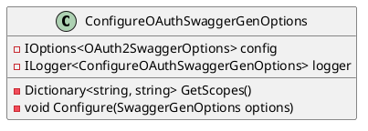
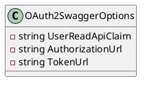
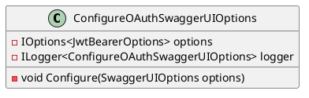

# Configuration Options for Swagger in OAuth2 Authentication

This documentation provides an overview of the configuration options for Swagger in OAuth2 authentication.

## Swagger OAuth2 Configuration Options

### `ConfigureOAuthSwaggerGenOptions`

The `ConfigureOAuthSwaggerGenOptions` class is responsible for configuring SwaggerGen options for OAuth2 authentication.

#### Class Diagram



### `GetScopes`

The `GetScopes` method retrieves the OAuth2 scopes that are required for Swagger.

### `Configure`

The `Configure` method is used to configure SwaggerGen options for OAuth2 authentication. It sets the security definition and security requirement for Swagger.

### `OAuth2SwaggerOptions`

The `OAuth2SwaggerOptions` class represents the options for configuring OAuth2 in Swagger.

#### Class Diagram



### `ConfigureOAuthSwaggerUIOptions`

The `ConfigureOAuthSwaggerUIOptions` class is responsible for configuring SwaggerUI options for OAuth authentication.

#### Class Diagram



### `Configure`

The `Configure` method is used to configure SwaggerUI options for OAuth authentication. It sets the OAuth client ID, uses parameter-less code challenge, and sets the scope separator.

## Sequence Diagram

The sequence diagram below shows the interaction between the `ConfigureOAuthSwaggerGenOptions` and `ConfigureOAuthSwaggerUIOptions` classes:

```plantuml
@startuml
sequenceDiagram
    participant SwaggerGenOptions as "SwaggerGenOptions"
    participant ConfigureOAuthSwaggerGenOptions as "ConfigureOAuthSwaggerGenOptions"
    participant OAuth2SwaggerOptions as "OAuth2SwaggerOptions"
    participant SwaggerUIOptions as "SwaggerUIOptions"
    participant ConfigureOAuthSwaggerUIOptions as "ConfigureOAuthSwaggerUIOptions"
    note as "OAuth2 configuration" over ConfigureOAuthSwaggerGenOptions, OAuth2SwaggerOptions

    SwaggerGenOptions->>ConfigureOAuthSwaggerGenOptions: Configure
    ConfigureOAuthSwaggerGenOptions->>OAuth2SwaggerOptions: GetScopes
    OAuth2SwaggerOptions->>ConfigureOAuthSwaggerGenOptions: SecurityDefinition
    ConfigureOAuthSwaggerGenOptions->>SwaggerGenOptions: Configure

    SwaggerUIOptions->>ConfigureOAuthSwaggerUIOptions: Configure
    ConfigureOAuthSwaggerUIOptions->>JwtBearerOptions: GetOAuthClientId
    ConfigureOAuthSwaggerUIOptions->>SwaggerUIOptions: Configure
endonuml
```

This sequence diagram shows how the `ConfigureOAuthSwaggerGenOptions` class configures the SwaggerGen options for OAuth2 authentication, and how the `ConfigureOAuthSwaggerUIOptions` class configures the SwaggerUI options for OAuth authentication.