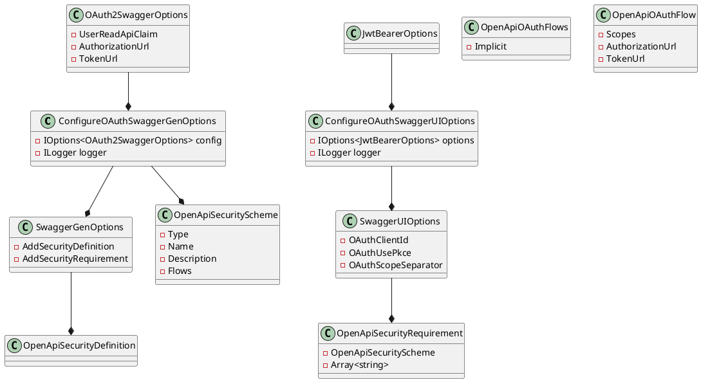

**README FILE**

**Summary**

This repository contains a set of source files that demonstrate the configuration of Swagger and OAuth2 authentication in an ASP.NET Core Web API application. The files include:

* `ConfigureOAuthSwaggerGenOptions.cs`: Configures SwaggerGen options for OAuth2 authentication.
* `ConfigureOAuthSwaggerUIOptions.cs`: Configures SwaggerUI options for OAuth authentication.
* `OAuth2SwaggerOptions.cs`: Represents the options for configuring OAuth2 in Swagger.

**Technical Summary**

The provided code uses several design patterns and architectural patterns:

* ** Dependency Injection**: The code uses the Microsoft.Extensions.DependencyInjection framework to inject dependencies into the configuration classes.
* **Factory pattern**: The `ConfigureOAuthSwaggerGenOptions` class uses the factory pattern to create instances of SwaggerGen options.
* **Strategy pattern**: The `OAuth2SwaggerOptions` class uses the strategy pattern to allow for different implementations of OAuth2 configuration.

The code also utilizes several architectural patterns:

* **Layered architecture**: The code follows a layered architecture, separating concerns into different layers (e.g., configuration, security, etc.).
* **Modularization**: The code is divided into separate modules (e.g., SwaggerGen, SwaggerUI, etc.) for better maintainability and reusability.

**Component Diagram**

Here is a component diagram illustrating the relationship between the classes:

Note: The `@startuml` and `@enduml` lines are required to indicate the start and end of the PlantUML code block.