**Summary**

The Eliassen.AspNetCore.JwtAuthentication package provides methods for configuring JWT Bearer authentication and SwaggerGen (OpenAPI3) services in ASP.NET Core projects. It offers a set of extension methods that can be used to configure JWT Bearer authentication and SwaggerGen services in the `IServiceCollection`. The package provides a flexible way to customize JWT Bearer authentication and SwaggerGen services.

**Technical Summary**

The package uses the following design patterns and architectural patterns:

* **Dependency Injection**: The package uses the `IServiceCollection` interface to inject services, which allows for loose coupling between components.
* **Chain of Responsibility**: The `TryAddJwtBearerServices` method is used to chain together multiple extension methods that configure JWT Bearer authentication and SwaggerGen services.
* **Strategy Pattern**: The `TryAddJwtBearerAuthentication` and `TryAddJwtBearerSwaggerGen` methods use strategy patterns to determine the configuration for JWT Bearer authentication and SwaggerGen services.

**Component Diagram**

```plantuml
@startuml
class JwtExtensionBuilder {
  - defaultSchema: string
  - jwtBearerConfigurationSection: string
  - oAuth2SwaggerConfigurationSection: string
}

class ServiceCollectionExtensions {
  - TryAddJwtBearerServices(services, configuration, builder)
  - TryAddJwtBearerAuthentication(services, configuration, defaultScheme, configurationSection)
  - TryAddJwtBearerSwaggerGen(services, configuration, configurationSection)
}

class JwtBearerOptions {
  - ConfigurationSection: string
}

class OAuth2SwaggerOptions {
  - ConfigurationSection: string
}

class JwtBearerAuthentication {
  - Configuration: IConfiguration
  - DefaultScheme: string
  - ConfigurationSection: string
}

class SwaggerGen {
  - Configuration: IConfiguration
  - ConfigurationSection: string
}

class ServiceCollection {
  - AddAuthentication(defaultScheme)
  - AddJwtBearer(options)
  - AddSwaggerGen(options)
  - TryAddJwtBearerServices(configuration, builder)
  - TryAddJwtBearerAuthentication(configuration, defaultScheme, configurationSection)
  - TryAddJwtBearerSwaggerGen(configuration, configurationSection)
}

JwtExtensionBuilder -> ServiceCollectionExtensions
ServiceCollectionExtensions -> JwtBearerOptions
ServiceCollectionExtensions -> OAuth2SwaggerOptions
ServiceCollectionExtensions -> JwtBearerAuthentication
ServiceCollectionExtensions -> SwaggerGen
ServiceCollectionExtensions -> ServiceCollection

@enduml
```

Note: This diagram is simplified and does not show all the dependencies and relationships between classes.