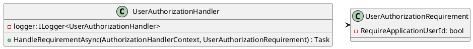

Here is the documentation for the source code in Markdown format, along with PlantUML diagrams:

**UserAuthorizationHandler.cs**
================================

This class is responsible for handling user authorization based on specified requirements.

### Class Diagram
