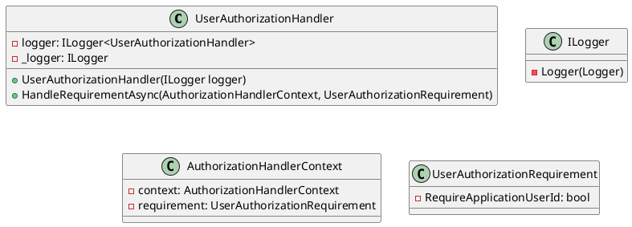
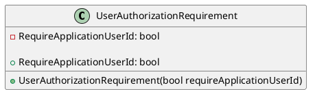

Here is the documentation for the source code files, including class diagrams in Plant UML:

**UserAuthorizationHandler.cs**

**Class Diagram**

**Documentation**

The `UserAuthorizationHandler` class is responsible for handling user authorization based on specified requirements. It is a custom authorization handler that inherits from `AuthorizationHandler<UserAuthorizationRequirement>`.

The handler takes an `ILogger` instance in its constructor, which is used to log information and warnings during the authorization process.

The `HandleRequirementAsync` method is responsible for handling the user authorization requirement asynchronously. It checks if the user is authenticated and if the application user ID is required for authorization. If both conditions are met, it logs information and succeeds the authorization requirement. Otherwise, it logs a warning and fails the authorization requirement.

**UserAuthorizationRequirement.cs**

**Class Diagram**

**Documentation**

The `UserAuthorizationRequirement` class represents an authorization requirement for user-specific authorization. It is a custom authorization requirement that is used by the `UserAuthorizationHandler` to determine whether a user is authorized.

The class has a single property `RequireApplicationUserId` which specifies whether the application user ID is required for authorization. The default value of this property is `true`.

Note: The class diagram for `UserAuthorizationRequirement` is a simple one since it is a small, simple class with only one property.