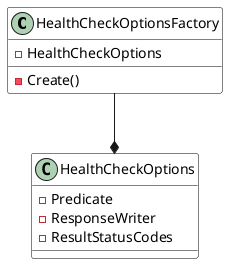

**README**

This repository contains a set of C# source files for generating health check options and implementing health checks in an ASP.NET Core application.

**Summary**

The `HealthCheckOptionsFactory` class is responsible for creating and configuring instances of `HealthCheckOptions`. This factory enables custom configuration of health check options, including predicate filtering, response writers, and status codes for different health check result statuses.

**Technical Summary**

The `HealthCheckOptionsFactory` class utilizes the following design patterns and architectural patterns:

* **Factory design pattern**: The factory class creates and returns instances of `HealthCheckOptions`, encapsulating the creation and configuration logic.
* **Builder pattern**: The `Create()` method uses a builder pattern to construct and configure a new instance of `HealthCheckOptions`.
* **ValueTuple**: The `ResultStatusCodes` dictionary uses value tuples to map health check statuses to HTTP status codes.

**Component Diagram**

This component diagram illustrates the `HealthCheckOptionsFactory` class as a singleton component that creates and configures instances of `HealthCheckOptions`. The `HealthCheckOptions` class represents the configuration options for a health check, and it has dependencies on a predicate, response writer, and result status codes.