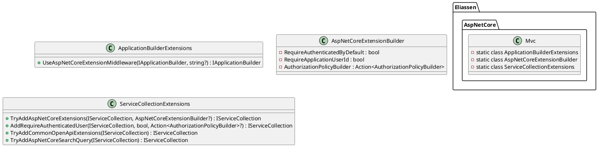

Here is the documentation for the provided source code files:

**ApplicationBuilderExtensions.cs**

This class contains extension methods for configuring ASP.NET Core extensions.

* Method: `UseAspNetCoreExtensionMiddleware` - Adds custom middleware to ASP.NET Core to support the extensions.
* Parameters: `builder`, `healthCheckPath`
* Returns: `IApplicationBuilder`

**AspNetCoreExtensionBuilder.cs**

This class represents a builder for configuring ASP.NET Core extensions.

* Properties:
	+ `RequireAuthenticatedByDefault`: A boolean indicating whether authentication is required by default.
	+ `RequireApplicationUserId`: A boolean indicating whether an application user ID is required.
	+ `AuthorizationPolicyBuilder`: An action delegate for configuring an `AuthorizationPolicyBuilder`.

**Eliassen.AspNetCore.Mvc.csproj**

This is the project file for the Eliassen.AspNetCore.Mvc library.

* Properties:
	+ `TargetFramework`: `net8.0`
	+ `GenerateDocumentationFile`: `True`
	+ `PackageReadmeFile`: `ReadMe.AspNetCore.Mvc.md`
* References:
	+ `Microsoft.AspNetCore.App`
	+ `Microsoft.IdentityModel.Logging`
	+ `Swashbuckle.AspNetCore.SwaggerGen`
	+ `Swashbuckle.AspNetCore`
	+ `Eliassen.AspNetCore.Abstractions`
	+ `Eliassen.Extensions`
	+ `Eliassen.System`

**ReadMe.AspNetCore.Mvc.md**

This is the README file for the Eliassen.AspNetCore.Mvc library.

* Summary: The library provides extensions for ASP.NET Core, including authentication, authorization, and search query support.
* Configuration: The library has several configuration options, including `TryAddAspNetCoreExtensions`, `AddRequireAuthenticatedUser`, `TryAddCommonOpenApiExtensions`, and `TryAddAspNetCoreSearchQuery`.
* Example: An example of configuring the library is provided.

**ServiceCollectionExtensions.cs**

This class contains extension methods for configuring ASP.NET Core services.

* Methods:
	+ `TryAddAspNetCoreExtensions`: Adds IOC configurations to support all ASP.NET Core extensions provided by the library.
	+ `AddRequireAuthenticatedUser`: Adds authentication requirements to the service collection.
	+ `TryAddCommonOpenApiExtensions`: Enables extensions for Swagger/OpenAPI.
	+ `TryAddAspNetCoreSearchQuery`: Enables extensions for shared search query extensions.

**PlantUML Class Diagram**

Here is the PlantUML class diagram for the provided source code files:

This diagram shows the relationships between the classes and methods in the provided source code files.