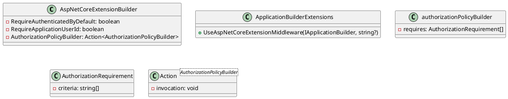

# Eliassen.AspNetCore.Mvc Documentation

## Overview

Eliassen.AspNetCore.Mvc is a set of ASP.NET Core extensions that provide authentication, authorization, search query support, and more. This documentation provides an overview of the project's architecture, usage, and configuration options.

### Class Diagram



### Component Model

```plantuml
@startuml
component AspNetCoreExtensionBuilder {
  - RequireAuthenticatedByDefault: boolean
  - RequireApplicationUserId: boolean
  - AuthorizationPolicyBuilder: Action<AuthorizationPolicyBuilder>
}
component ApplicationBuilderExtensions {
  + UseAspNetCoreExtensionMiddleware(IApplicationBuilder, string?)
}
component authorizationPolicyBuilder {
  - requires: AuthorizationRequirement[]
}
component AuthorizationRequirement {
  - criteria: string[]
}
component Action<AuthorizationPolicyBuilder> {
  - invocation: void
}
@enduml
```

### Sequence Diagram

```plantuml
@startuml
sequenceDiagram
 participant AspNetCoreExtensionBuilder as Builder
 participant ApplicationBuilderExtensions as Extensions
 participant IApplicationBuilder as App
 participant Action<AuthorizationPolicyBuilder> as BuilderAction
 note "Configure extensions" as ConfigureExtensions
 Builder->>App: UseAspNetCoreExtensionMiddleware(IApplicationBuilder, string?)
 Extensions->>App: UseAspNetCoreExtensionMiddleware(IApplicationBuilder, string?)
 Builder->>BuilderAction: AuthorizationPolicyBuilder
 BuilderAction->>BuilderAction: Action<AuthorizationPolicyBuilder>(IApplicationBuilder, string?)
-endo
@enduml
```

## Source Files

### Application Builder Extensions

The `ApplicationBuilderExtensions` class provides extension methods for configuring ASP.NET Core extensions and related services.

* `UseAspNetCoreExtensionMiddleware(this IApplicationBuilder builder, string? healthCheckPath = "/health")`: Adds custom middleware to ASP.NET Core to support the extensions.

### AspNetCoreExtensionBuilder

The `AspNetCoreExtensionBuilder` class represents a builder for configuring ASP.NET Core extensions.

* `RequireAuthenticatedByDefault`: A boolean value indicating whether authentication is required by default.
* `RequireApplicationUserId`: A boolean value indicating whether the application user ID is required.
* `AuthorizationPolicyBuilder`: An action that configures the authorization policy builder.

### Eliassen.AspNetCore.Mvc.csproj

This is the ASP.NET Core project file for Eliassen.AspNetCore.Mvc. It includes references to other projects and packages.

### ReadMe.AspNetCore.Mvc.md

This is the ReadMe file for Eliassen.AspNetCore.Mvc. It provides an overview of the project, configuration options, and an example of how to use the extensions.

### ServiceCollectionExtensions

The `ServiceCollectionExtensions` class provides extension methods for configuring ASP.NET Core services.

* `TryAddAspNetCoreExtensions(this IServiceCollection services, AspNetCoreExtensionBuilder? builder = null)`: Adds services for ASP.NET Core extensions, including health checks, OpenAPI, and search query extensions.
* `AddRequireAuthenticatedUser(this IServiceCollection services, bool requireApplicationUserId = true, Action<AuthorizationPolicyBuilder>? authorizationPolicyBuilder = null)`: Adds authentication requirements to the service collection.
* `TryAddCommonOpenApiExtensions(this IServiceCollection services)`: Enables extensions for Swagger/OpenAPI.
* `TryAddAspNetCoreSearchQuery(this IServiceCollection services)`: Enables extensions for shared search query extensions.

### Example

Here is an example of how to configure the code:
```csharp
public void ConfigureServices(IServiceCollection services)
{
    services.TryAddAspNetCoreExtensions(
        requireAuthenticatedByDefault: true,
        requireApplicationUserId: true,
        authorizationPolicyBuilder: policyBuilder =>
        {
            policyBuilder.RequireClaim("scope", "api1");
            policyBuilder.RequireClaim("scope", "api2");
        }
    );

    services.AddRequireAuthenticatedUser(
        requireApplicationUserId: true,
        authorizationPolicyBuilder: policyBuilder =>
        {
            policyBuilder.RequireClaim("role", "admin");
        }
    );

    services.TryAddCommonOpenApiExtensions();
    services.TryAddAspNetCoreSearchQuery();
}
```
This example configures the extensions to require authentication by default, require an application user ID, and add two authorization policies. It also enables Swagger/OpenAPI and search query extensions.