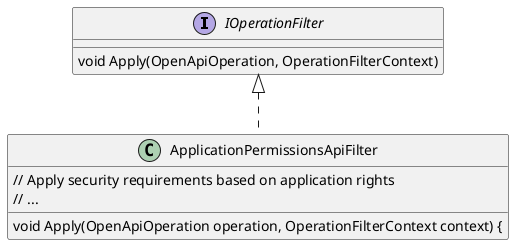

Here is the documentation for the provided source code:

**ApplicationPermissionsApiFilter.cs**
```

This class filter extends Swagger/OpenAPI to include application rights in the Swagger documentation. It checks for `AllowAnonymousAttribute` and `ApplicationRightAttribute` on the controller action and adds security requirements accordingly.

**FormFileOperationFilter.cs**
```
```plantuml
@startuml
class OpenApiSchema {
  - String typename
  - Properties
}

class OpenApiRequestBody {
  - Content
}

class FormFileOperationFilter implements IOperationFilter {
  void Apply(OpenApiOperation operation, OperationFilterContext context) {
    // Check for file upload in request body
    // ...
    if (supportsFileUpload) {
      // Add file upload parameters to OpenApiSchema
      // ...
    }
  }
}

@enduml
```
This class filter extends Swagger/OpenAPI to handle file uploads in the Swagger UI. It checks for file uploads in the request body and adds file upload parameters to the OpenApiSchema.

**SearchQueryOperationFilter.cs**
```
```plantuml
@startuml
class OpenApiSchema {
  - Properties
}

class OpenApiParameter {
  - Name
  - Schema
  - In
}

class SearchQueryOperationFilter implements IOperationFilter {
  void Apply(OpenApiOperation operation, OperationFilterContext context) {
    // Check for IQueryable<T> in the action return type
    // ...
    if (supportsSearchQuery) {
      // Add search query parameters to OpenApiSchema
      // ...
      // Add filtering and sorting parameters to OpenApiSchema
      // ...
    }
  }
}

@enduml
```
This class filter extends Swagger/OpenAPI to provide search query options in the Swagger UI. It checks for IQueryable<T> in the action return type and adds search query parameters to the OpenApiSchema.

**SearchQueryResultFilter.cs**
```
```plantuml
@startuml
interface IResultFilter {
  void OnResultExecuting(ResultExecutingContext)
  void OnResultExecuted(ResultExecutedContext)
}

class SearchQueryResultFilter implements IResultFilter {
  void OnResultExecuting(ResultExecutingContext context) {
    // Check for IQueryable<T> in the result
    // ...
    if (supportsSearchQuery) {
      // Filter the query using the search query builder
      // ...
    }
  }
}

@enduml
```
This class filter executes a search query on the result of the action before returning it. It uses the search query builder to filter the query.

**Component Diagram**

```plantuml
@startuml
class SearchQueryOperationFilter
class OpenApiSchema
class OpenApiParameter
class IOperationFilter

SearchQueryOperationFilter --|> OpenApiSchema
SearchQueryOperationFilter --|> OpenApiParameter
SearchQueryOperationFilter --+> IOperationFilter

@enduml
```
This component diagram shows the relationships between the SearchQueryOperationFilter, OpenApiSchema, OpenApiParameter, and IOperationFilter components.

**Sequence Diagram**

```plantuml
@startuml
actor User
participant SearchQueryOperationFilter
participant OpenApiSchema
participant OpenApiParameter
note "User sends request to server"
User ->> SearchQueryOperationFilter: Send request
SearchQueryOperationFilter ->> OpenApiSchema: Get OpenApiSchema
OpenApiSchema ->> OpenApiParameter: Get OpenApiParameter
SearchQueryOperationFilter ->> OpenApi.getParameter: Get search query parameters
note "Search query parameters added to OpenApiSchema"
@enduml
```
This sequence diagram shows the flow of events when a user sends a request to the server and the SearchQueryOperationFilter adds search query parameters to the OpenApiSchema.