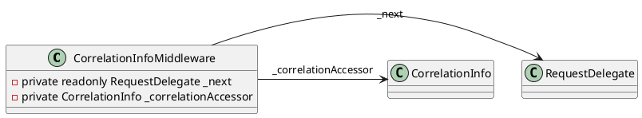
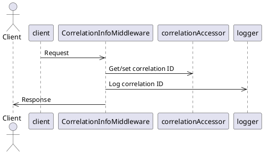
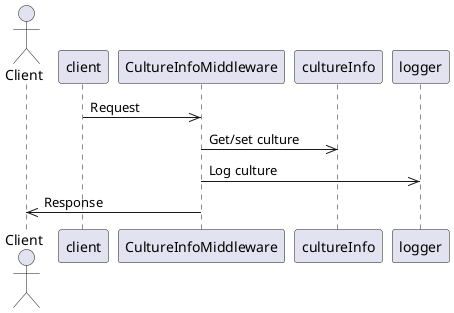
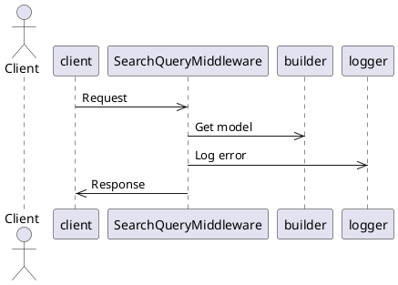

Here is the documentation for the source code in Markdown format:

# Middleware Documentation

This documentation covers three middleware classes: `CorrelationInfoMiddleware`, `CultureInfoMiddleware`, and `SearchQueryMiddleware`. Each middleware is designed to perform a specific task to enhance the functionality of an ASP.NET Core MVC application.

## CorrelationInfoMiddleware

The `CorrelationInfoMiddleware` class is responsible for handling correlation information in HTTP requests and responses. It provides a way to capture and store correlation identifiers (IDs) and request IDs in the HTTP context.

### Class Diagram


### Invoke Method
The `Invoke` method is the entry point for the middleware. It is responsible for processing the request and response correlation IDs.

### Component Model
```plantuml
@startuml
component CorrelationInfoMiddleware {
    (RequestDelegate) next
    (CorrelationInfo) correlationAccessor
    (ILogger) logger
}

CorrelationInfoMiddleware ->> next: Invoke
CorrelationInfoMiddleware ->> correlationAccessor: Get/set correlation ID
CorrelationInfoMiddleware ->> logger: Log correlation ID
@enduml
```

### Sequence Diagram


## CultureInfoMiddleware

The `CultureInfoMiddleware` class is responsible for detecting and setting the language/culture from the HTTP request and response headers.

### Class Diagram
```plantuml
@startuml
class CultureInfoMiddleware {
    - private readonly RequestDelegate _next
    - private CultureInfo? _cultureInfo
    - private IAccessor<CultureInfo> _cultureInfoAccessor
}

CultureInfoMiddleware -> RequestDelegate: _next
CultureInfoMiddleware -> CultureInfo: _cultureInfo
CultureInfoMiddleware -> IAccessor<CultureInfo>: _cultureInfoAccessor
@enduml
```

### Invoke Method
The `Invoke` method is the entry point for the middleware. It is responsible for processing the request and response culture information.

### Component Model
```plantuml
@startuml
component CultureInfoMiddleware {
    (RequestDelegate) next
    (CultureInfo) cultureInfo
    (ILogger) logger
}

CultureInfoMiddleware ->> next: Invoke
CultureInfoMiddleware ->> cultureInfo: Get/set culture
CultureInfoMiddleware ->> logger: Log culture
@enduml
```

### Sequence Diagram


## SearchQueryMiddleware

The `SearchQueryMiddleware` class is responsible for enabling IQueryable responses from Controller Actions.

### Class Diagram
```plantuml
@startuml
class SearchQueryMiddleware {
    - private readonly RequestDelegate _next
    - private ILogger _logger
    - private IAccessor<ISearchQuery> _searchQueryAccessor
    - private ISearchModelBuilder _builder
}

SearchQueryMiddleware -> RequestDelegate: _next
SearchQueryMiddleware -> ILogger: _logger
SearchQueryMiddleware -> IAccessor<ISearchQuery>: _searchQueryAccessor
SearchQueryMiddleware -> ISearchModelBuilder: _builder
@enduml
```

### InvokeAsync Method
The `InvokeAsync` method is the entry point for the middleware. It is responsible for processing the request and setting the search query.

### Component Model
```plantuml
@startuml
component SearchQueryMiddleware {
    (RequestDelegate) next
    (ILogger) logger
    (IAccessor<ISearchQuery>) searchQueryAccessor
    (ISearchModelBuilder) builder
}

SearchQueryMiddleware ->> next: InvokeAsync
SearchQueryMiddleware ->> logger: Log error
SearchQueryMiddleware ->> searchQueryAccessor: Set search query
SearchQueryMiddleware ->> builder: Get model
@enduml
```

### Sequence Diagram


I hope this documentation helps to provide a comprehensive understanding of the middleware classes and their functionality.