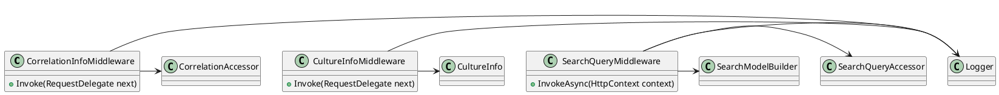

**README File**

This repository contains a set of middleware classes written in C# for the ASP.NET Core framework. These middlewares aim to enhance the functionality of an ASP.NET Core application by providing features such as correlation tracking, culture detection, and search query handling.

**Summary**

1. `CorrelationInfoMiddleware`: This middleware is responsible for managing correlation information in HTTP requests and responses. It sets a correlation ID on the request and response headers, and logs information about the correlation ID and request ID.
2. `CultureInfoMiddleware`: This middleware detects the language/culture from the HTTP request header and assigns it to the response header. It also logs information about the detected culture.
3. `SearchQueryMiddleware`: This middleware enables IQueryable responses from Controller Actions by binding a search model to the request. It logs information about the search query and model.

**Technical Summary**

The design patterns and architectural patterns used in these middlewares are:

1. **Middleware Pattern**: Each middleware class inherits from the `RequestDelegate` interface and overrides the `Invoke` method to handle the request and response.
2. **Dependency Injection**: The middlewares use dependency injection to inject dependencies such as loggers, accessor objects, and builders.
3. **Functional Programming**: The `SearchQueryMiddleware` uses functional programming concepts to process the search query and create an IQueryable response.
4. **Asynchronous Programming**: The middlewares use asynchronous programming techniques to handle requests and responses asynchronously.

**Component Diagram**

