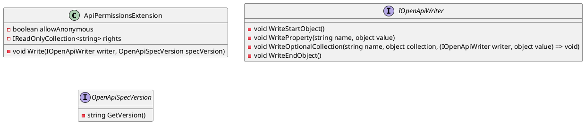

# ApiPermissionsExtension Documentation

## Introduction

The `ApiPermissionsExtension` class is a part of the Eliassen.AspNetCore.Mvc.OpenApi namespace and is used to declare permissions required for application endpoints. This class is designed to be used with OpenAPI to provide metadata about an API.

## Class Diagram




## Usage

To use the `ApiPermissionsExtension` class, instantiate it with the `allowAnonymous` and `rights` parameters. The `allowAnonymous` parameter is a boolean that indicates whether the endpoint allows unauthenticated requests. The `rights` parameter is an enumerable collection of strings that specifies the required permissions.

Here is an example of how to use the class:
```csharp
ApiPermissionsExtension permissions = new ApiPermissionsExtension(true, new[] {"admin", "moderator"});
```
This would create an instance of the `ApiPermissionsExtension` class that allows anonymous requests and requires at least one of the "admin" or "moderator" permissions.

## Write Method

The `Write` method is used to generate the required permissions property for an OpenAPI specification. This method takes two parameters: an `IOpenApiWriter` and an `OpenApiSpecVersion`. The `IOpenApiWriter` is used to write the OpenAPI specification, and the `OpenApiSpecVersion` is used to specify the version of the OpenAPI specification.

Here is an example of how to use the `Write` method:
```csharp
permissions.Write(writer, OpenApiSpecVersion.OpenApi3_0);
```
This would generate the required permissions property for OpenAPI 3.0.

## Sequence Diagram

```plantuml
@startuml
autonumber true

actor "Client" as c
participant "Server" as s
participant "OpenApiWriter" as w
participant "ApiPermissionsExtension" as a

c->s: API Request
s->w: Write OpenAPI Specification
a->w: Generate Required Permissions Property
w->a: Write Required Permissions Property
w->s: OpenAPI Specification
s->c: Response with OpenAPI Specification

@enduml
```