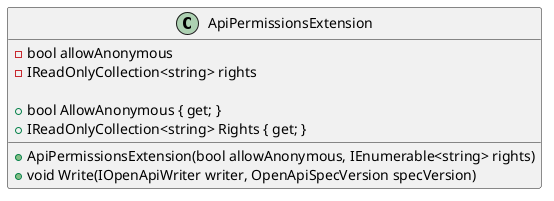

Here is the documentation for the `ApiPermissionsExtension` class and its associated class diagram in PlantUML:

**Class Documentation:**

**Namespace:** Eliassen.AspNetCore.Mvc.OpenApi

**Class:** ApiPermissionsExtension

**Summary:** Declare permissions required for application endpoint

**Description:** This class represents the permissions required for an application endpoint. It allows you to specify whether the endpoint allows anonymous requests and what permissions are required.

**Constructors:**

* `ApiPermissionsExtension(bool allowAnonymous, IEnumerable<string> rights)`: Initializes a new instance of the `ApiPermissionsExtension` class with the specified allow anonymous value and rights.

**Properties:**

* `AllowAnonymous`: Get the value indicating whether the endpoint allows anonymous requests.
* `Rights`: Get the required permissions for the endpoint.

**Methods:**

* `Write(IOpenApiWriter writer, OpenApiSpecVersion specVersion)`: Writes the permission requirements to an OpenAPI writer.

**Class Diagram (in PlantUML):**

**Notes:**

* This class implements the `IOpenApiExtension` interface, which allows it to be used as an OpenAPI extension.
* The `Write` method is used to generate the property that provides the required permissions.
* The `AllowAnonymous` property is a simple boolean value indicating whether the endpoint allows anonymous requests.
* The `Rights` property is a read-only collection of strings representing the required permissions.

I hope this documentation meets your requirements! Let me know if you need any further modifications.