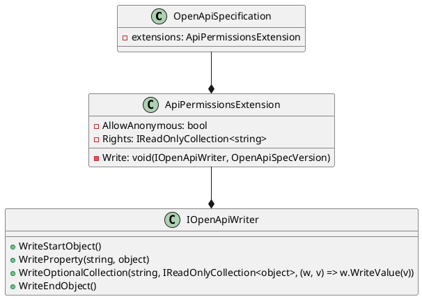

**README FILE**

**Summary**

The source file `ApiPermissionsExtension.cs` provides a functionality to declare permissions required for application endpoints. It allows the developer to specify whether an endpoint allows unauthenticated requests (allowAnonymous) and the required permissions (rights) as a collection of strings. This extension can be used in OpenAPI (Swagger) specifications to provide additional information about the permissions required for each endpoint.

**Technical Summary**

The `ApiPermissionsExtension` class implements the `IOpenApiExtension` interface, which is used to provide additional information to OpenAPI specifications. The class has two main properties: `AllowAnonymous` and `Rights`, which are used to store the permissions required for the endpoint. The `Write` method is used to generate the required permissions property in the OpenAPI specification.

The design pattern used in this file is the **Data Access Object (DAO)** pattern, where the `ApiPermissionsExtension` class acts as a bridge between the OpenAPI specification and the required permissions. This pattern helps to decouple the data access logic from the business logic, making it easier to maintain and evolve the code.

The architectural pattern used in this file is the **Layered Architecture** pattern, where the `ApiPermissionsExtension` class resides in the **Infrastructure** layer, which is responsible for providing the necessary infrastructure for the application to function. This layer provides a set of services and classes that are used by the **Application** layer to interact with the OpenAPI specification.

**Component Diagram**

The component diagram shows the relationship between the `OpenApiSpecification`, `ApiPermissionsExtension`, and `IOpenApiWriter` classes. The `OpenApiSpecification` class has a reference to a list of `ApiPermissionsExtension` objects, which are used to provide additional information about the permissions required for each endpoint. The `ApiPermissionsExtension` class implements the `IOpenApiWriter` interface, which provides the necessary methods to write the required permissions property to the OpenAPI specification.