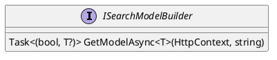
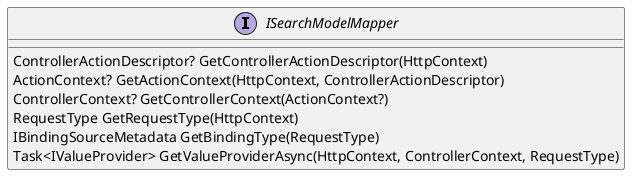
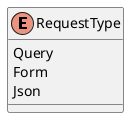

Here is the documentation for the provided source code files, including class diagrams in PlantUML:

**ISearchModelBuilder.cs**
```csharp
/// <summary>
/// Builds search models based on the incoming HTTP context.
/// </summary>
public interface ISearchModelBuilder
{
    /// <summary>
    /// Gets the search model asynchronously from the provided HTTP context.
    /// </summary>
    /// <typeparam name="T">The type of the model.</typeparam>
    /// <param name="context">The HTTP context containing the model data.</param>
    /// <param name="modelName">The name of the model in the context.</param>
    /// <returns>A tuple indicating whether the search is successful and the retrieved model.</returns>
    Task<(bool isSearch, T? model)> GetModelAsync<T>(HttpContext context, string modelName = "") where T : class;
}
```

**Class Diagram (PlantUML)**


**ISearchModelMapper.cs**
```csharp
/// <summary>
/// Maps search-related model information from the HTTP context.
/// </summary>
public interface ISearchModelMapper
{
    /// <summary>
    /// Retrieves the controller action descriptor from the provided HTTP context.
    /// </summary>
    /// <param name="context">The HTTP context.</param>
    /// <returns>The controller action descriptor if found; otherwise, null.</returns>
    ControllerActionDescriptor? GetControllerActionDescriptor(HttpContext context);

    /// <summary>
    /// Creates an action context from the provided HTTP context and controller action descriptor.
    /// </summary>
    /// <param name="context">The HTTP context.</param>
    /// <param name="descriptor">The controller action descriptor.</param>
    /// <returns>The created action context if both parameters are valid; otherwise, null.</returns>
    ActionContext? GetActionContext(HttpContext context, ControllerActionDescriptor descriptor);

    /// <summary>
    /// Creates a controller context from the provided action context.
    /// </summary>
    /// <param name="context">The action context.</param>
    /// <returns>The created controller context if the action context is valid; otherwise, null.</returns>
    ControllerContext? GetControllerContext(ActionContext? context);

    /// <summary>
    /// Determines the type of request based on the provided HTTP context.
    /// </summary>
    /// <param name="context">The HTTP context.</param>
    /// <returns>The type of request.</returns>
    RequestType GetRequestType(HttpContext context);

    /// <summary>
    /// Retrieves the binding type metadata based on the request type.
    /// </summary>
    /// <param name="requestType">The type of request.</param>
    /// <returns>The binding type metadata.</returns>
    IBindingSourceMetadata GetBindingType(RequestType requestType);

    /// <summary>
    /// Retrieves the value provider asynchronously based on the request type.
    /// </summary>
    /// <param name="context">The HTTP context.</param>
    /// <param name="controllerContext">The controller context.</param>
    /// <param name="requestType">The type of request.</param>
    /// <returns>The value provider.</returns>
    Task<IValueProvider> GetValueProviderAsync(HttpContext context, ControllerContext controllerContext, RequestType requestType);
}
```

**Class Diagram (PlantUML)**


**RequestType.cs**
```csharp
/// <summary>
/// Represents the type of HTTP request.
/// </summary>
public enum RequestType
{
    /// <summary>
    /// Indicates a request with JSON data.
    /// </summary>
    Query,

    /// <summary>
    /// Indicates a request with form data.
    /// </summary>
    Form,

    /// <summary>
    /// Indicates a request with JSON data.
    /// </summary>
    Json,
}
```

**Class Diagram (PlantUML)**


**SearchModelBuilder.cs**
```csharp
/// <summary>
/// Builds search models based on the incoming HTTP context.
/// </summary>
public class SearchModelBuilder : ISearchModelBuilder
{
    private readonly ISearchModelMapper _mapper;

    public SearchModelBuilder(ISearchModelMapper mapper) => _mapper = mapper;

    public async Task<(