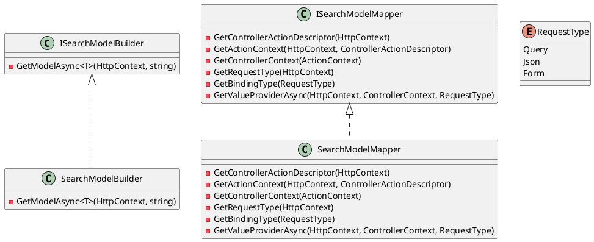

# Eliassen.AspNetCore.Mvc.Providers.SearchQuery

## Overview

The Eliassen.AspNetCore.Mvc.Providers.SearchQuery namespace provides a set of services and interfaces for building and mapping search models in ASP.NET Core MVC applications.

**Source Files**

* `ISearchModelBuilder.cs`
* `ISearchModelMapper.cs`
* `RequestType.cs`
* `SearchModelBuilder.cs`
* `SearchModelMapper.cs`

## Interfaces

### ISearchModelBuilder

The `ISearchModelBuilder` interface defines the methods for building and retrieving search models from the HTTP context.

* `GetModelAsync<T>(HttpContext context, string modelName = "")`: Gets the search model asynchronously from the provided HTTP context.
* `GetModelAsync<T>(HttpContext context, string modelName = "")`: Gets the search model asynchronously from the provided HTTP context.

### ISearchModelMapper

The `ISearchModelMapper` interface defines the methods for mapping search-related model information from the HTTP context.

* `GetControllerActionDescriptor(HttpContext context)`: Retrieves the controller action descriptor from the provided HTTP context.
* `GetActionContext(HttpContext context, ControllerActionDescriptor descriptor)`: Creates an action context from the provided HTTP context and controller action descriptor.
* `GetControllerContext(ActionContext context)`: Creates a controller context from the provided action context.
* `GetRequestType(HttpContext context)`: Determines the type of request based on the provided HTTP context.
* `GetBindingType(RequestType requestType)`: Retrieves the binding type metadata based on the request type.
* `GetValueProviderAsync(HttpContext context, ControllerContext controllerContext, RequestType requestType)`: Retrieves the value provider asynchronously based on the request type.

## Classes

### SearchModelBuilder

The `SearchModelBuilder` class implements the `ISearchModelBuilder` interface and provides the logic for building and retrieving search models from the HTTP context.

* `SearchModelBuilder(ISearchModelMapper mapper)`: Initializes a new instance of the `SearchModelBuilder` class.
* `GetModelAsync<T>(HttpContext context, string modelName = "")`: Gets the search model asynchronously from the provided HTTP context.

### SearchModelMapper

The `SearchModelMapper` class implements the `ISearchModelMapper` interface and provides the logic for mapping search-related model information from the HTTP context.

* `SearchModelMapper()`: Initializes a new instance of the `SearchModelMapper` class.
* `GetControllerActionDescriptor(HttpContext context)`: Retrieves the controller action descriptor from the provided HTTP context.
* `GetActionContext(HttpContext context, ControllerActionDescriptor descriptor)`: Creates an action context from the provided HTTP context and controller action descriptor.
* `GetControllerContext(ActionContext context)`: Creates a controller context from the provided action context.
* `GetRequestType(HttpContext context)`: Determines the type of request based on the provided HTTP context.
* `GetBindingType(RequestType requestType)`: Retrieves the binding type metadata based on the request type.
* `GetValueProviderAsync(HttpContext context, ControllerContext controllerContext, RequestType requestType)`: Retrieves the value provider asynchronously based on the request type.

### RequestType

The `RequestType` enum defines the possible types of requests.

* `Query`: Indicates a request with JSON data.
* `Json`: Indicates a request with form data.
* `Form`: Indicates a request with form data.

## Class Diagram



## Component Model

```plantuml
@startuml
!include https://raw.githubusercontent.com/plantuml-stdlib/bootstrap-theme/plantuml-bootstrap.min.css

participant "HttpRequest"
participant "ControllerActionDescriptor"
participant "ActionContext"
participant "ControllerContext"
participant "SearchModelBuilder"
participant "ISearchModelMapper"
participant "ISearchModelBuilder"
participant "SearchModelMapper"

notice right of HttpRequest "GET /search" as GetHttpRequest
notice right of ControllerActionDescriptor "ControllerActionDescriptor" as Descriptor
notice right of ActionContext "ActionContext" as ActionContext
notice right of ControllerContext "ControllerContext" as ControllerContext
notice right of SearchModelBuilder "SearchModelBuilder"
notice right of ISearchModelMapper