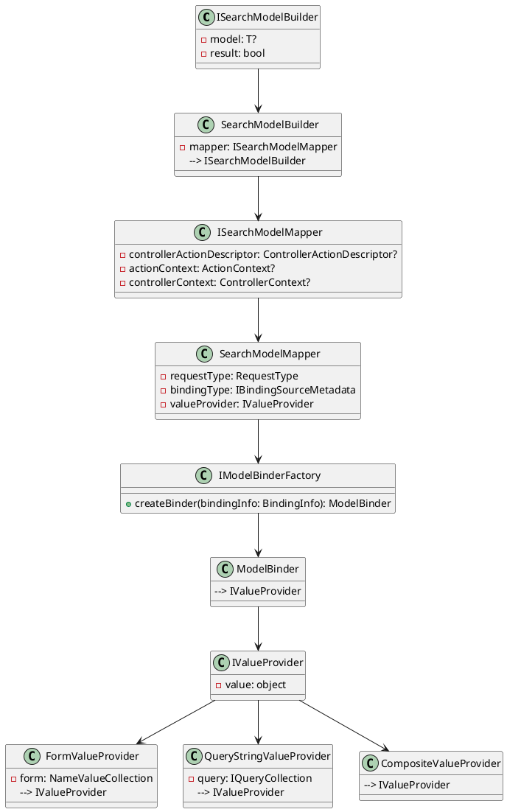

**README File**

This repository contains a set of C# source files used to build a search model builder and mapper for an ASP.NET Core application. The search model builder and mapper provide functionality for building and mapping search models from HTTP requests.

**Summary**

The search model builder (`ISearchModelBuilder`) is responsible for building search models based on the incoming HTTP context. It uses the `ISearchModelMapper` to retrieve the controller action descriptor, action context, and controller context from the HTTP context. The model builder then uses these contexts to create a model binder and bind the model to the context.

The `ISearchModelMapper` provides functionality for mapping search-related model information from the HTTP context. It retrieves the controller action descriptor, action context, and controller context from the HTTP context and creates value providers for forms, JSON, and query string data.

**Technical Summary**

The search model builder and mapper use several design patterns and architectural patterns:

1. **Single Responsibility Principle (SRP)**: The `ISearchModelBuilder` and `ISearchModelMapper` interfaces provide distinct functionalities and separate responsibilities.
2. **Dependency Injection (DI)**: The `SearchModelBuilder` and `SearchModelMapper` classes use dependency injection to inject dependencies such as the `ISearchModelMapper` and `IModelBinderFactory`.
3. **Factory Pattern**: The `IModelBinderFactory` provides a factory for creating model binders.
4. **Strategy Pattern**: The `ISearchModelMapper` uses the request type (form, JSON, or query string) to determine the binding type metadata.

**Component Diagram**

Here is a component diagram of the search model builder and mapper using PlantUML:

This diagram illustrates the relationships between the classes and interfaces involved in the search model builder and mapper.