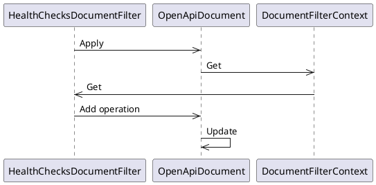
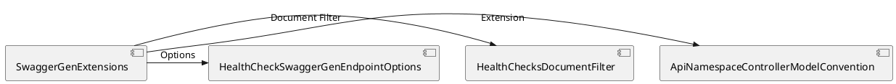

Here is the documentation for the source code in Markdown format, including PlantUML diagrams:

# SwaggerGen Extensions for Health Checks

## Overview

This package provides SwaggerGen extensions for configuring controller groups as the related assembly name and adding health check endpoints to the OpenAPI document.

## Source Files

### `ApiNamespaceControllerModelConvention.cs`

```plantuml
@startuml
class ApiNamespaceControllerModelConvention implements IControllerModelConvention
    - public void Apply(ControllerModel controller)
@enduml
```

This class performs a SwaggerGen extension to configure controller group as the related assembly name.

```cs
using Microsoft.AspNetCore.Mvc.ApplicationModels;

namespace Eliassen.AspNetCore.Mvc.SwaggerGen
{
    public class ApiNamespaceControllerModelConvention : IControllerModelConvention
    {
        public void Apply(ControllerModel controller) => controller.ApiExplorer.GroupName = controller.ControllerType.Assembly.GetName().Name;
    }
}
```

### `HealthChecksDocumentFilter.cs`

```plantuml
@startuml
class HealthChecksDocumentFilter implements IDocumentFilter
    - public void Apply(OpenApiDocument openApiDocument, DocumentFilterContext context)
@enduml
```

This class represents a document filter for health checks in the OpenAPI document.

```cs
using Microsoft.OpenApi.Models;
using Swashbuckle.AspNetCore.SwaggerGen;
using System.Collections.Generic;

namespace Eliassen.AspNetCore.Mvc.SwaggerGen
{
    public class HealthChecksDocumentFilter : IDocumentFilter
    {
        public const string HealthCheckEndpoint = @"/health"; //TODO: make so this can be looked up

        public void Apply(OpenApiDocument openApiDocument, DocumentFilterContext context)
        {
            var pathItem = new OpenApiPathItem();

            var operation = new OpenApiOperation();
            operation.Tags.Add(new OpenApiTag { Name = "ApiHealth" });

            var properties = new Dictionary<string, OpenApiSchema>
            {
                { "status", new OpenApiSchema() { Type = "string" } },
                { "errors", new OpenApiSchema() { Type = "array" } }
            };

            var response = new OpenApiResponse();
            response.Content.Add("application/json", new OpenApiMediaType
            {
                Schema = new OpenApiSchema
                {
                    Type = "object",
                    AdditionalPropertiesAllowed = true,
                    Properties = properties,
                }
            });

            operation.Responses.Add("200", response);
            pathItem.AddOperation(OperationType.Get, operation);
            openApiDocument?.Paths.Add(HealthCheckEndpoint, pathItem);
        }
    }
}
```

### `HealthCheckSwaggerGenEndpointOptions.cs`

```plantuml
@startuml
class HealthCheckSwaggerGenEndpointOptions implements IConfigureOptions<SwaggerGenOptions>
    - public void Configure(SwaggerGenOptions options)
@enduml
```

This class represents configuration options for SwaggerGen related to health check endpoints.

```cs
using Microsoft.Extensions.DependencyInjection;
using Microsoft.Extensions.Options;
using Swashbuckle.AspNetCore.SwaggerGen;

namespace Eliassen.AspNetCore.Mvc.SwaggerGen
{
    public class HealthCheckSwaggerGenEndpointOptions : IConfigureOptions<SwaggerGenOptions>
    {
        public void Configure(SwaggerGenOptions options)
        {
            options.DocumentFilter<HealthChecksDocumentFilter>();
        }
    }
}
```

## Sequence Diagrams

Here is a sequence diagram for the `HealthChecksDocumentFilter` class:


## Component Model

Here is a component model diagram for the SwaggerGen extensions:


This documentation provides an overview of the source code, including explanations of each class and its purpose. It also includes sequence diagrams and component models to provide a visual representation of the code and its interactions.