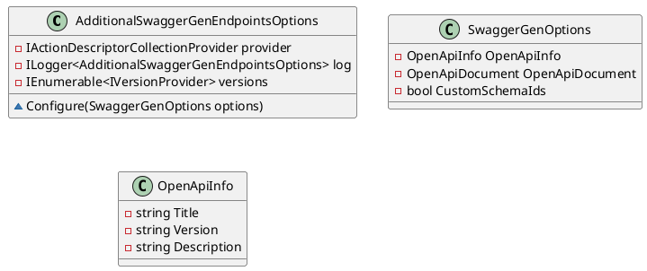
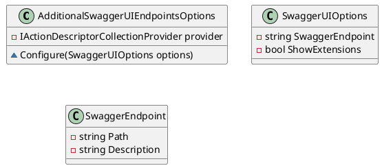
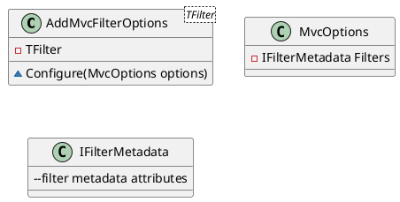
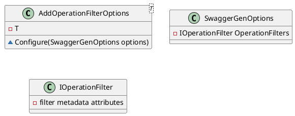
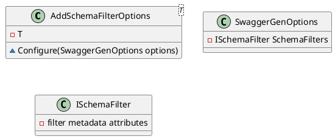
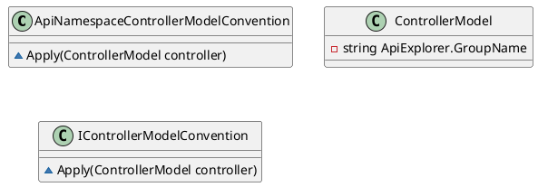
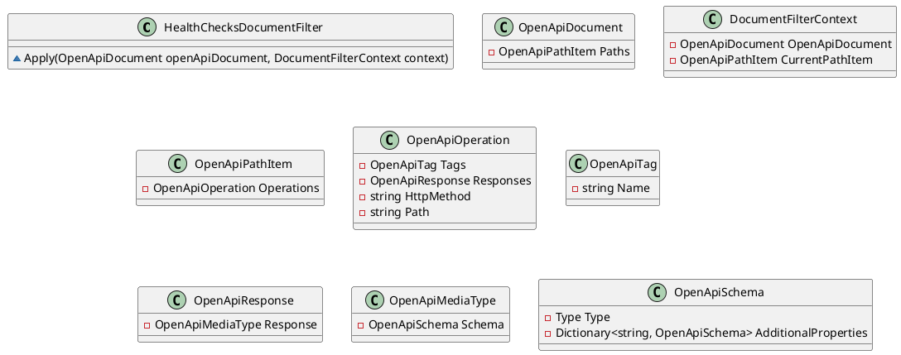
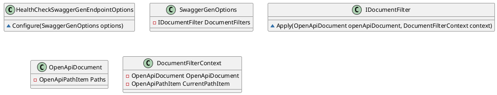

Here is the documentation for each of the source code files, along with class diagrams in PlantUML:

**AdditionalSwaggerGenEndpointsOptions.cs**

This class provides additional configuration options for SwaggerGen. It allows you to:

* Present permissions and application versions
* Include XML documentation comments
* Configure SwaggerGen to use a custom schema ID resolver

Class Diagram:

**AdditionalSwaggerUIEndpointsOptions.cs**

This class provides additional configuration options for SwaggerUI. It allows you to:

* Group controller actions by assembly

Class Diagram:

**AddMvcFilterOptions.cs**

This class allows you to add additional ASP.NET MVC filters. It is used to register filters with the MVC options.

Class Diagram:

**AddOperationFilterOptions.cs**

This class allows you to add additional operation filters. It is used to register filters with the SwaggerGen options.

Class Diagram:

**AddSchemaFilterOptions.cs**

This class allows you to add additional schema filters. It is used to register filters with the SwaggerGen options.

Class Diagram:

**ApiNamespaceControllerModelConvention.cs**

This class provides a convention for SwaggerGen to use the assembly name as the group name for controller actions.

Class Diagram:

**HealthChecksDocumentFilter.cs**

This class provides a document filter for health checks in the OpenAPI document.

Class Diagram:

**HealthCheckSwaggerGenEndpointOptions.cs**

This class provides configuration options for SwaggerGen related to health check endpoints.

Class Diagram:

Please note that these class diagrams only represent the relationships between the classes and do not include the implementation details of the methods.