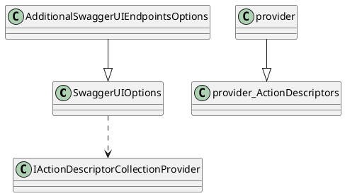
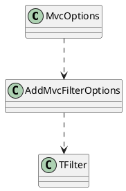
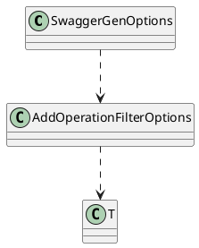
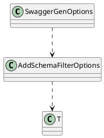

**Documentation for Eliassen.AspNetCore.Mvc.SwaggerGen**

**Overview**

The Eliassen.AspNetCore.Mvc.SwaggerGen namespace provides additional functionality for SwaggerGen and SwaggerUI in ASP.NET MVC applications. It includes classes for configuring SwaggerGen options, registering filters, and extending the functionality of SwaggerUI.

**Classes and Interfaces**

### AdditionalSwaggerGenEndpointsOptions.cs

This class extends the `SwaggerGenOptions` class to provide additional features for SwaggerGen, such as presenting permissions, application versions, and XML documentation.

**Sequence Diagram**

```plantuml
@startuml
class SwaggerGenOptions
class AdditionalSwaggerGenEndpointsOptions
class ILogger
class IVersionProvider
 AdditionalSwaggerGenEndpointsOptions --|> SwaggerGenOptions
 SwaggerGenOptions ..> ILogger
 SwaggerGenOptions ..> IVersionProvider
logger ..> log message
@enduml
```

### AdditionalSwaggerUIEndpointsOptions.cs

This class extends the `SwaggerUIOptions` class to provide additional features for SwaggerUI, such as grouping controller/actions by assembly.

**Sequence Diagram**



### AddMvcFilterOptions.cs

This class provides a way to register additional ASP.NET MVC filters.

**Class Diagram**



### AddOperationFilterOptions.cs

This class provides a way to register additional operation filters for SwaggerGen.

**Class Diagram**



### AddSchemaFilterOptions.cs

This class provides a way to register additional schema filters for SwaggerGen.

**Class Diagram**



**Components**

* **SwaggerGen**: The SwaggerGen component is responsible for generating Swagger documentation for ASP.NET MVC applications.
* **SwaggerUI**: The SwaggerUI component provides a user interface for interacting with Swagger documentation.
* ** ILogger**: The ILogger interface provides a way to log messages from the SwaggerGen and SwaggerUI components.
* **IVersionProvider**: The IVersionProvider interface provides a way to retrieve application versions.

**System Design**

The Eliassen.AspNetCore.Mvc.SwaggerGen namespace is designed to be extensible and flexible. It provides a way to register additional filters and configure SwaggerGen and SwaggerUI options to meet specific requirements.

The classes in this namespace are designed to work together to provide a comprehensive solution for generating Swagger documentation and providing a user interface for interacting with that documentation.