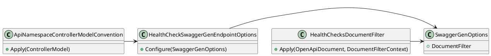

**README File**

**Summary**

The provided code snippet consists of three SwaggerGen extensions for generating OpenAPI specifications for ASP.NET Core web applications. These extensions aim to improve the functionality of SwaggerGen by adding custom extensions and conventions.

**Technical Summary**

The extensions use various design patterns and architectural patterns, such as:

* **Single responsibility principle (SRP)**: Each extension has a single responsibility, making it easier to understand and maintain.
* **Dependency injection (DI)**: The extensions use dependency injection to inject dependencies, such as `SwaggerGenOptions`, to ensure loose coupling and flexibility.
* **Aspect-oriented programming (AOP)**: The `HealthChecksDocumentFilter` uses AOP to apply filters to the OpenAPI document, providing a flexible way to handle concerns related to health checks.

**Component Diagram**

In this diagram, we can see the relationships between the different components:

* `ApiNamespaceControllerModelConvention` uses the `HealthCheckSwaggerGenEndpointOptions` to configure `SwaggerGenOptions`.
* `HealthCheckSwaggerGenEndpointOptions` uses `SwaggerGenOptions` to configure the SwaggerGen settings.
* `HealthChecksDocumentFilter` uses `SwaggerGenOptions` to apply filters to the OpenAPI document.

Note that this diagram is a simplified representation of the relationships between the components, focusing on the main interactions and dependencies between the extensions.