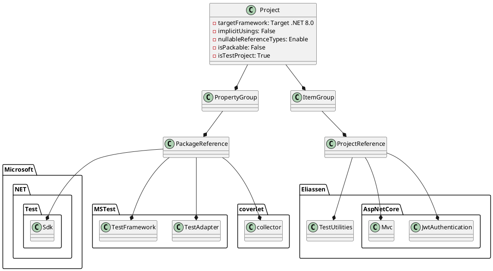

# Eliassen.AspNetCore.Tests Documentation

## Project File


```plantuml
@startuml
class Project {
  -targetFramework: Target .NET 8.0
  -implicitUsings: False
  -nullableReferenceTypes: Enable
  -isPackable: False
  -isTestProject: True
}

Project --* PropertyGroup
PropertyGroup --* PackageReference
PackageReference --* Microsoft.NET.Test.Sdk
PackageReference --* MSTest.TestAdapter
PackageReference --* MSTest.TestFramework
PackageReference --* coverlet.collector

Project --* ItemGroup
ItemGroup --* ProjectReference
ProjectReference --* Eliassen.AspNetCore.JwtAuthentication
ProjectReference --* Eliassen.AspNetCore.Mvc
ProjectReference --* Eliassen.TestUtilities

@enduml
```

```plantuml
```