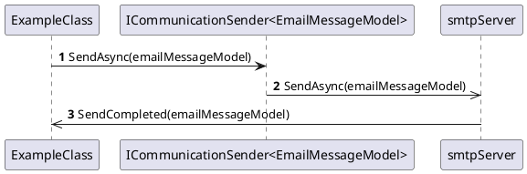

Here is the documentation for the source code in Markdown format:

**Eliassen.Communications.Abstractions**

### Summary

The Eliassen Communications libraries are an abstraction designed to asynchronously send messages over a dedicated channel such as Email and SMS.

### Components

The following components are part of the Eliassen.Communications.Abstractions library:

#### `ICommunicationSender<TMessage>`

The `ICommunicationSender<TMessage>` interface is provided as a means to interact with various channel providers. Example channels are hosted for `EmailMessageModel` and `SmsMessageModel`.

**Class Diagram**
```plantuml
@startuml
class ICommunicationSender<TMessage> {
  - sendAsync(TMessage message): Task<string>
}

class EmailMessageModel {
  // Attributes and methods
}

class SmsMessageModel {
  // Attributes and methods
}

ICommunicationSender<TMessage] <|-- EmailMessageModel
ICommunicationSender<TMessage] <|-- SmsMessageModel
@enduml
```
#### `ExampleClass`

```csharp
//Include ICommunicationSender<EmailMessageModel> in your service class

public class ExampleClass (
    ICommunicationSender<EmailMessageModel> email
    )
{
    public async Task<string> SendAsync(EmailMessageModel message) =>
        await email.SendAsync(message);
}
```
### How to Use

To use the Eliassen.Communications.Abstractions library, you need to reference the `Microsoft.Extensions.Configuration.Abstractions` NuGet package and include the `ICommunicationSender<TMessage>` interface in your service class.

**Sequence Diagram**

### Contact

For more information about the Eliassen Communications libraries, please refer to the [Eliassen Communications website](https://www.eliassen.com/communications).

I hope this helps! Let me know if you have any further questions.