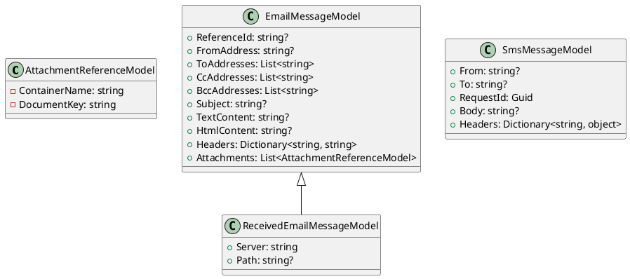
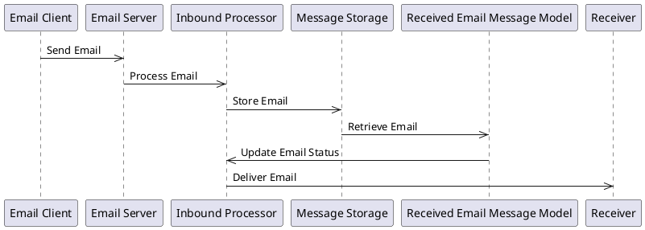
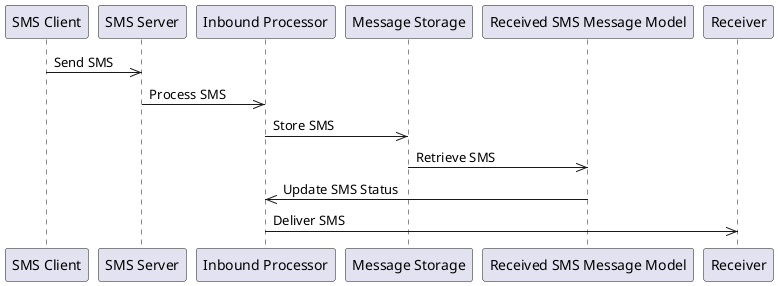

# Eliassen Communications Models Documentation

This documentation outlines the classes and models used to represent email and SMS messages, attachments, and other relevant data in the Eliassen Communications system.

## Class Diagram

## Component Model

The Eliassen Communications system consists of several components, including:

* **Email Processing**: responsible for processing inbound and outbound email messages
* **SMS Processing**: responsible for processing inbound and outbound SMS messages
* **Attachment Management**: responsible for managing attachments associated with email and SMS messages
* **Message Storage**: responsible for storing and retrieving email and SMS messages

These components interact with each other to provide a comprehensive communication solution.

## Sequence Diagram

The following sequence diagram illustrates the flow of an email message from sending to receiving:

The following sequence diagram illustrates the flow of an SMS message from sending to receiving:

The Eliassen Communications system provides a robust and scalable solution for managing email and SMS messages. The system's components work together to ensure that messages are correctly processed, stored, and delivered to the intended recipients.