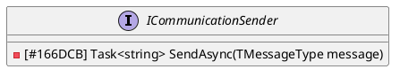
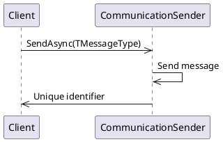

**Documentation for Eliassen.Communications.Services**

### ICommunicationSender Interface

This interface represents an abstract contract for sending communication messages of a specified type. It provides a method for asynchronously sending a message and returning its unique identifier.

#### Interface Definition

```ICommunicationSender.cs
using System.Threading.Tasks;

namespace Eliassen.Communities.Services;

/// <summary>
/// Represents an interface for sending communication messages of a specified type.
/// <see href="https://eliassenps.atlassian.net/browse/NIT-12">NIT-12</see>
/// <see href="https://eliassenps.atlassian.net/browse/NDM-368">NDM-368</see>
/// <see href="https://eliassenps.atlassian.net/browse/NDM-366">NDM-366</see>
/// </summary>
/// <typeparam name="TMessageType">The type of the communication message.</typeparam>
public interface ICommunicationSender<TMessageType>
{
    /// <summary>
    /// Asynchronously sends the specified communication message.
    /// </summary>
    /// <param name="message">The communication message to send.</param>
    /// <returns>A task representing the asynchronous operation. The result is the unique identifier associated with the sent message.</returns>
    Task<string> SendAsync(TMessageType message);
}
```

### Class Diagram



### Component Model

The `ICommunicationSender` interface is a key component in the Eliassen.Communications.Services namespace, enabling communication message sending functionality.

### Sequence Diagram



In this sequence diagram, the client initiates a request to send a communication message using the `SendAsync` method. The `CommunicationSender` component sends the message and returns a unique identifier associated with the sent message to the client.