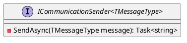

Here is the documentation for the `ICommunicationSender` interface and its UML class diagram:

**Interface Documentation**

**Name**: `ICommunicationSender<TMessageType>`

**Namespace**: `Eliassen.Communications.Services`

**Summary**: Represents an interface for sending communication messages of a specified type.

**Description**: This interface defines a contract for sending communication messages of a specific type. The interface is generic, allowing the type of message to be determined by the implementing class.

**Methods**:

* `SendAsync(TMessageType message)`: Asynchronously sends the specified communication message. Returns a task representing the asynchronous operation, which includes the unique identifier associated with the sent message.

**References**:

* <https://eliassenps.atlassian.net/browse/NIT-12>
* <https://eliassenps.atlassian.net/browse/NDM-368>
* <https://eliassenps.atlassian.net/browse/NDM-366>

**UML Class Diagram**

This UML class diagram represents the `ICommunicationSender` interface with a single method, `SendAsync`, which takes a message of type `TMessageType` and returns a task representing the asynchronous operation. The `<TMessageType>` parameter is denoted by the angle brackets in the interface name.

Note that since this is an interface, it does not have any attributes or private members. The focus is on defining the contract for sending communication messages.