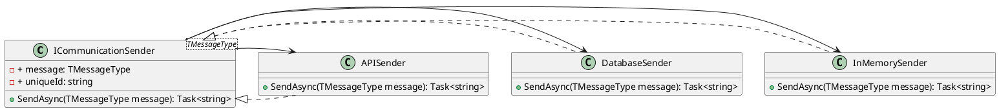

**README File**

**Summary**

The provided source files are related to a communication system that enables sending messages of a specified type. The system consists of an interface `ICommunicationSender<TMessageType>` that defines the contract for sending communication messages asynchronously. The `SendAsync` method sends a message and returns a task with the unique identifier associated with the sent message.

**Technical Summary**

The design pattern used in this implementation is the **Abstract Factory** pattern, as the `ICommunicationSender<TMessageType>` interface provides a way to generate concrete instances of senders for specific message types without specifying the exact classes of the senders.

The architectural pattern used is the **Decorator** pattern, as the sender interface can be decorated with different senders (e.g., in-memory, database, or API-based) without modifying the client code.

**Component Diagram**

