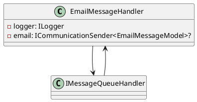
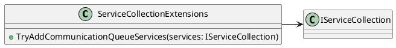
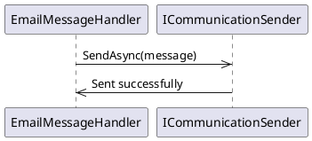
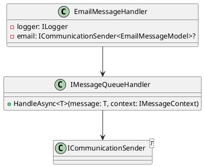

**Eliassen.Communications.MessageQueueing**

### Description

Eliassen.Communications.MessageQueueing is a module designed to facilitate message queueing for communication-related tasks. It provides a robust and scalable solution for sending and handling email messages asynchronously.

### Components

#### EmailMessageHandler

This class represents a message handler tailored for handling and sending email messages asynchronously.

**Methods**

* **Constructor**: Initializes a new instance of the EmailMessageHandler class.
* **HandleAsync(EmailMessageModel, IMessageContext)**: Handles the specified email message asynchronously.
* **HandleAsync(Object, IMessageContext)**: Handles the specified message asynchronously.

#### ServiceCollectionExtensions

This class provides extension methods for configuring communication queue services within the application.

**Methods**

* **TryAddCommunicationQueueServices**: Attempts to add communication queue services to the specified service collection.

### Sequence Diagram

Here is a sequence diagram illustrating the communication between the EmailMessageHandler and the ICommunicationSender.

### Class Diagram

Here is a class diagram illustrating the relationships between the EmailMessageHandler and other classes.

**README FILE**

# Eliassen.Communications.MessageQueueing

Eliassen.Communications.MessageQueueing is a module designed to facilitate message queueing for communication-related tasks. Let's delve into its components:

## EmailMessageHandler

This class represents a message handler tailored for handling and sending email messages asynchronously.

### Methods

* **Constructor**: Initializes a new instance of the EmailMessageHandler class.
* **HandleAsync(EmailMessageModel, IMessageContext)**: Handles the specified email message asynchronously.
* **HandleAsync(Object, IMessageContext)**: Handles the specified message asynchronously.

## ServiceCollectionExtensions

This class provides extension methods for configuring communication queue services within the application.

### Methods

* **TryAddCommunicationQueueServices**: Attempts to add communication queue services to the specified service collection.

Eliassen.Communications.MessageQueueing offers streamlined functionality for integrating email message handling into message queueing systems, enhancing communication workflows within applications.