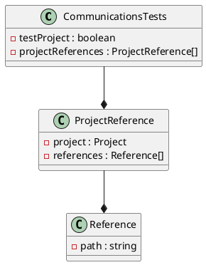

# Eliassen Communications Tests Documentation

## Project Structure

The `Eliassen.Communications.Tests` project is a .NET Core 8 project that contains test cases for the `Eliassen.Communications` project.

### Class Diagram



### Component Model

The `Eliassen.Communications.Tests` project consists of the following components:

* `CommunicationsTests`: This is the main test class that contains all the test methods.
* `ProjectReference`: This is an inner class that represents a project reference.
* `Reference`: This is an inner class that represents a reference to another project.

### Sequence Diagram

```plantuml
@startuml
participant "CommunicationsTests" as test
participant "ProjectReference" as reference
participant "Reference" as ref

note "Test execution"
alt isTestRunning
  test -> reference: GetProjectReference()
  reference -> ref: GetReferencePath()
  test -> ref: ExecuteReference()
end
@enduml
```

## Configuration

The project has the following configuration options:

* `TargetFramework`: The target framework version for the project, which is set to `net8.0`.
* `ImplicitUsings`: Set to `false` to disable implicit usings.
* `Nullable`: Set to `enable` to enable nullable reference types.
* `IsPackable`: Set to `false` to prevent the project from being packed.
* `IsTestProject`: Set to `true` to indicate that this is a test project.
* `PackageReferences`: References to external packages, including Microsoft.NET.Test.Sdk, MSTest.TestAdapter, and MSTest.TestFramework.
* `ProjectReferences`: References to other projects in the solution, including `Eliassen.Communications` and `Eliassen.System`.