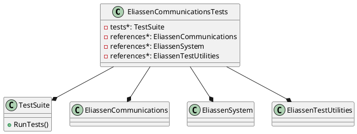

Here is the documentation for the `Eliassen.Communications.Tests.csproj` file:

**Project Information**

* Project Name: Eliassen Communications Tests
* Project Type: Test Project
* Target Framework: .NET 8.0
* Implicit Usings: False
* Nullable: Enabled
* Packable: False
* Test Project: True

**NuGet Packages**

* Microsoft.NET.Test.Sdk (version 17.10.0)
* MSTest.TestAdapter (version 3.4.3)
* MSTest.TestFramework (version 3.4.3)
* coverlet.collector (version 6.0.2)

**Project References**

* Eliassen.Communications (project reference)
* Eliassen.System (project reference)
* Eliassen.TestUtilities (project reference)

**Class Diagram (PlantUML)**

[elassen-communications-tests.puml]

**Note:** The PlantUML code generates a simple class diagram showing the relationships between the `EliassenCommunicationsTests` class, `TestSuite` class, and the project references. Additionally, it does not include any detailed information about the classes or methods, but rather provides an overall view of the project's structure.