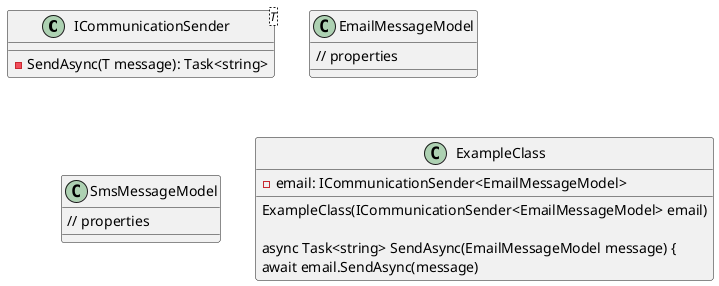
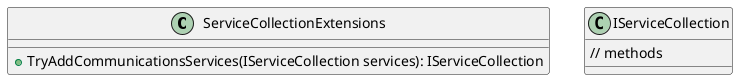

Here is the documentation for the source code files, including class diagrams in PlantUML:

**Eliassen.Communications.csproj**

The `Eliassen.Communications.csproj` file is a project file for a .NET Core 8.0 project. It specifies the project's properties and dependencies.

### Properties

* `TargetFramework`: The target framework for the project is .NET Core 8.0.
* `ImplicitUsings`: Implicit usings are disabled.
* `Nullable`: All types in the project are nullable.
* `GenerateDocumentationFile`: Documentation files will be generated for the project.
* `PackageReadmeFile`: The README file for the package is `Readme.Communications.md`.
* `GenerateAssemblyInfo`: Assembly information files will be generated.

### Dependencies

* `Eliassen.Communications.Abstractions`: References the `Eliassen.Communications.Abstractions` project.
* `Eliassen.Extensions`: References the `Eliassen.Extensions` project.

### Class Diagram

Here is the class diagram for the project:

**Readme.Communications.md**

The `Readme.Communications.md` file contains a summary of the Eliassen Communications libraries.

### Summary

The Eliassen Communications libraries are an abstraction designed to asynchronously send messages over a dedicated channel, such as Email and SMS.

### Example

The `ICommunicationSender<T>` interface is provided as a means to interact with various channel providers. Example channels are hosted for `EmailMessageModel` and `SmsMessageModel`.

```csharp
// Include ICommunicationSender<EmailMessageModel> in your service class
public class ExampleClass {
  - email: ICommunicationSender<EmailMessageModel>

  ExampleClass(ICommunicationSender<EmailMessageModel> email)

  async Task<string> SendAsync(EmailMessageModel message) {
    await email.SendAsync(message)
  }
}
```
**ServiceCollectionExtensions.cs**

The `ServiceCollectionExtensions` class contains extension methods for configuring communication services in an `IServiceCollection`.

### Summary

Extension methods for configuring communication services in `IServiceCollection`.

### Method

* `TryAddCommunicationsServices`: Adds communication-related services to the specified `IServiceCollection`. Returns the modified `IServiceCollection`.

### Class Diagram

Here is the class diagram for the `ServiceCollectionExtensions` class:
