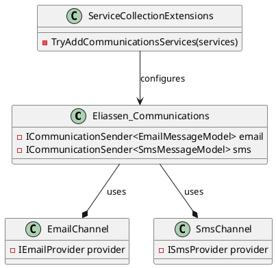

**README: Eliassen Communications**

**Summary**
The Eliassen Communications libraries provide a scalable and maintainable way to send messages asynchronously over various channels, such as email and SMS. The libraries offer a abstraction layer for message sending, allowing for easy integration with different providers and multiple message types.

**Technical Summary**
The Eliassen Communications libraries employ the Repository Pattern to separate the communication logic from the message sending mechanism. The `ICommunicationSender<>` interface is used to encapsulate the message sending logic, allowing for easy extension to new message types and providers. The ServiceCollectionExtensions class provides a mechanism to configure communication services in an ASP.NET Core application.

**Design Patterns and Architectural Patterns**
The Eliassen Communications libraries utilize the Repository Pattern, a creational design pattern that defines a set of methods for performing operations on a data source. The `ICommunicationSender<>` interface also follows the Interface Segregation Principle, a design pattern that aims to reduce the direct coupling between classes by abstracting the interface and providing multiple interfaces that can be used independently.

**Component Diagram**

