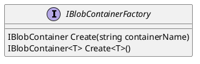
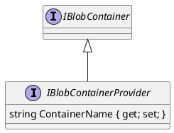
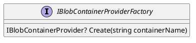

Here is the documentation for the provided source code files, including class diagrams in Plant UML:

**IBlobContainerFactory.cs**

**Class Diagram:**

**Documentation:**

The `IBlobContainerFactory` interface defines two methods for creating blob containers. The `Create` method takes a `string` parameter `containerName` and returns an `IBlobContainer` instance. The second method, `Create<T>`, is a generic method that takes a type parameter `T` and returns an `IBlobContainer<T>` instance.

**IBlobContainerProvider.cs**

**Class Diagram:**

**Documentation:**

The `IBlobContainerProvider` interface extends the `IBlobContainer` interface and adds a property `ContainerName` of type `string`. This interface represents a blob container that is specific to a particular provider type.

**IBlobContainerProviderFactory.cs**

**Class Diagram:**

**Documentation:**

The `IBlobContainerProviderFactory` interface defines a single method `Create` that takes a `string` parameter `containerName` and returns an `IBlobContainerProvider` instance, or `null` if the container does not exist.

Note: The `?` symbol after `Create` method indicates that it returns a nullable value (`IBlobContainerProvider?`).

These interfaces can be used to create a factory pattern for blob containers, where a factory is responsible for creating instances of blob containers based on their names or types.