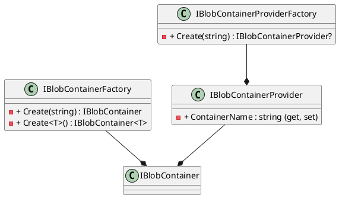
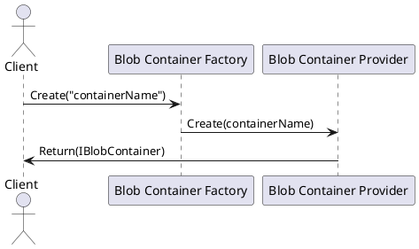

Here is the documentation for the source code in markdown format, including class diagrams, component models, and sequence diagrams in PlantUML:

### Introduction
This documentation provides an overview of the `Eliassen.Documents.Containers` namespace, which contains interfaces and factories for working with blob containers.

### Class Diagram
```

```

### Component Model
```
```plantuml
@startuml
component "Blob Container Factory" as ibcf {
  .. IBlobContainerFactory ..
}

component "Blob Container Provider" as ibcp {
  .. IBlobContainerProvider ..
}

component "Blob Container Provider Factory" as icbpf {
  .. IBlobContainerProviderFactory ..
}

ibcf --* ibcp
ibpf --* ibcp
icbpf --* ibcp
@enduml
```
```

### Sequence Diagram
```

```

### Implementation
The `IBlobContainerFactory` interface is used to create blob containers by name or type reference. The `Create` method returns an instance of the `IBlobContainer` interface, while the `Create<T>` method returns an instance of the `IBlobContainer<T>` interface.

The `IBlobContainerProvider` interface is used to provide a blob container for a particular provider type. It has a `ContainerName` property that returns or sets the name of the related container.

The `IBlobContainerProviderFactory` interface is used to create a blob container provider by name for a particular provider type. The `Create` method returns an instance of the `IBlobContainerProvider` interface or null if no provider is found.

### Usage
To use the `IBlobContainerFactory`, you can create an instance of the interface and call the `Create` or `Create<T>` method to retrieve an instance of the `IBlobContainer` or `IBlobContainer<T>` interface. You can then use the returned interface to work with the blob container.

To use the `IBlobContainerProvider`, you can create an instance of the interface and use the `ContainerName` property to retrieve or set the name of the related container.

To use the `IBlobContainerProviderFactory`, you can create an instance of the interface and call the `Create` method to retrieve an instance of the `IBlobContainerProvider` interface or null if no provider is found. You can then use the returned interface to work with the blob container provider.