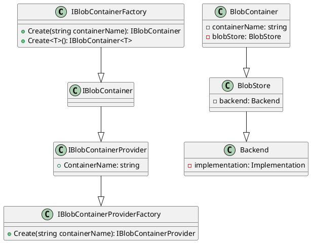

**Readme File**

This repository contains the implementation of a blob storage container and provider using C#. The following components are part of the system:

1. `IBlobContainerFactory`: an interface that provides methods to create blob containers by name or type reference.
2. `IBlobContainerProvider`: an interface that represents a blob container for a particular provider type, with a `ContainerName` property.
3. `IBlobContainerProviderFactory`: an interface that provides a factory method to create a blob provider by related name for a particular provider type.

**Technical Summary**

The components are designed using the Factory Pattern to encapsulate the creation of blob containers and providers. The `IBlobContainerFactory` interface defines the contract for creating blob containers, while the `IBlobContainerProviderFactory` interface provides a factory method to create blob providers.

The architecture is based on the Dependency Inversion Principle (DIP), where the `IBlobContainerFactory` and `IBlobContainerProviderFactory` interfaces are decoupled from the concrete implementations of the blob containers and providers.

**Component Diagram**

Here is a component diagram using PlantUML:
```

```
In this diagram, the components are represented as classes, with arrows indicating the relationships between them. The `IBlobContainerFactory` and `IBlobContainerProviderFactory` interfaces are abstract, while the `BlobContainer` and `BlobStore` classes are concrete implementations. The `Backend` class is a third-party dependency that provides the backend storage for the blob containers.

Note: The PlantUML syntax used in this diagram is based on the latest version of the language.