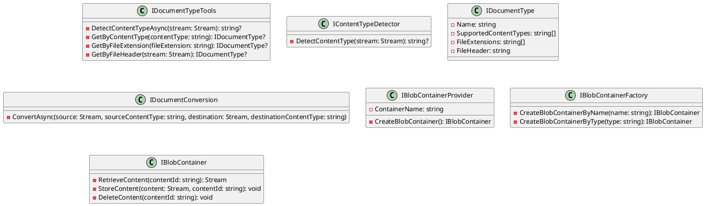

# Eliassen.Documents Documentation

## Overview

The Eliassen.Documents namespace provides a set of interfaces and attributes for interacting with document-related functionalities such as blob containers, document conversion, content type detection, and document type management.

## Key Components

### Interfaces

* **IDocumentTypeTools**: Provides tools for working with document types, including content type detection and retrieval of document types by file extension or header.
* **IContentTypeDetector**: Detects content type from a stream.
* **IDocumentType**: Represents a document type, providing information such as supported content types, file extensions, and file headers.
* **IBlobContainerProvider**: Provides a blob container for a particular provider type.
* **IBlobContainerFactory**: Factory interface for building blob containers by name or type reference.
* **IDocumentConversion**: Provides a service responsible for document conversion, with a method for converting documents from one format to another.
* **IBlobContainer**: Interface for interacting with blob containers, providing methods for content retrieval, storage, and deletion.

### Attributes

* **BlobContainerAttribute**: Configuration attribute for Blob Containers, specifying the container name.

### Models

* **ContentMetaDataReference**: Represents a reference to content metadata, including content type, file name, and metadata.
* **ContentReference**: Represents a reference to content, containing information such as content type, file name, and content itself.
* **DocumentType**: Represents a document type, including its name, supported content types, file extensions, and file header.

### Class Diagram



## Getting Started

Interfaces in the Eliassen.Documents namespace provide contracts for implementing various document-related functionalities. Implement these interfaces in your application to integrate document management features such as blob storage, document conversion, and content type detection.

## Example Usage

```csharp
// Example of implementing IBlobContainerProvider interface
public class MyBlobContainerProvider : IBlobContainerProvider
{
    public string ContainerName { get; }

    public MyBlobContainerProvider(string containerName)
    {
        ContainerName = containerName;
    }

    public IBlobContainer CreateBlobContainer()
    {
        // Implementation to create a blob container
    }
}

// Example of using IDocumentConversion interface
public class MyDocumentConversionService : IDocumentConversion
{
    public async Task ConvertAsync(Stream source, string sourceContentType, Stream destination, string destinationContentType)
    {
        // Implementation of document conversion logic
    }
}
```