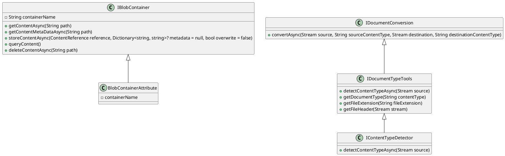

Here is the documentation for the provided source code files:

**Eliassen.Documents.Abstractions**

This namespace provides interfaces and attributes for interacting with document-related functionalities such as blob containers, document conversion, content type detection, and document type management.

**Interfaces**

* **IBlobContainer**: Interface for interacting with blob containers, providing methods for content retrieval, storage, and deletion.
* **IDocumentConversion**: Interface for a service responsible for document conversion, with a method for converting documents from one format to another.
* **IDocumentTypeTools**: Interface providing tools for working with document types, including content type detection and retrieval of document types by file extension or header.
* **IContentTypeDetector**: Interface for detecting content type from a stream.

**Attributes**

* **BlobContainerAttribute**: Configuration attribute for Blob Containers, specifying the container name.

**Models**

* **ContentMetaDataReference**: Represents a reference to content metadata, including content type, file name, and metadata.
* **ContentReference**: Represents a reference to content, containing information such as content type, file name, and content itself.
* **DocumentType**: Represents a document type, including its name, supported content types, file extensions, and file header.
* **IDocumentType**: Interface representing a document type, providing information such as name, supported content types, file extensions, and file headers.

**Example Usage**

To use these interfaces and attributes, implement them in your application according to the interface specifications. For example, you can create a blob container provider that creates a new blob container and implements the `IBlobContainer` interface to provide methods for content retrieval, storage, and deletion.

**Class Diagram**

Here is the class diagram for the Eliassen.Documents.Abstractions namespace in PlantUML:

This class diagram shows the relationships between the interfaces and attributes in the Eliassen.Documents.Abstractions namespace.