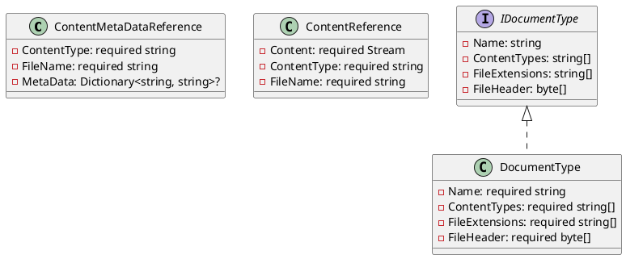
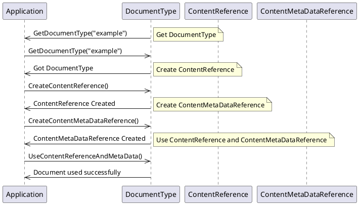

# Eliassen Documents Models Documentation

## Overview

The Eliassen Documents Models library provides a set of classes and interfaces for representing and working with documents and their associated metadata.

### Class Diagram

### Component Model

The Eliassen Documents Models library consists of several components that work together to provide a comprehensive solution for working with documents and their metadata.

#### Content MetaData Reference

The `ContentMetaDataReference` class represents a reference to content metadata, including the content type, file name, and associated metadata.

#### Content Reference

The `ContentReference` class represents a content reference, which contains information about the content, including the content type, file name, and a stream representing the content.

#### Document Type

The `DocumentType` class represents a document type, which includes its name, supported content types, file extensions, and file header.

#### IDocumentType Interface

The `IDocumentType` interface defines the common properties and methods that all document types must implement.

### Sequence Diagram

This sequence diagram shows the steps involved in initializing a document type, creating a content reference, creating a content metadata reference, and using the content reference and metadata reference to work with a document.

### Code Explanation

The Eliassen Documents Models library provides a set of classes and interfaces that allow developers to work with documents and their associated metadata. The `ContentMetaDataReference` class represents a reference to content metadata, including the content type, file name, and associated metadata. The `ContentReference` class represents a content reference, which contains information about the content, including the content type, file name, and a stream representing the content. The `DocumentType` class represents a document type, which includes its name, supported content types, file extensions, and file header. The `IDocumentType` interface defines the common properties and methods that all document types must implement.

### Benefits

The Eliassen Documents Models library provides several benefits, including:

* A clear and consistent way of representing and working with documents and their associated metadata
* A set of reusable classes and interfaces that can be used across multiple applications
* Simplified development and maintenance of document-oriented applications

### Conclusion

The Eliassen Documents Models library provides a comprehensive set of classes and interfaces for working with documents and their associated metadata. The library includes a set of reusable classes and interfaces that can be used across multiple applications, simplifying development and maintenance of document-oriented applications.