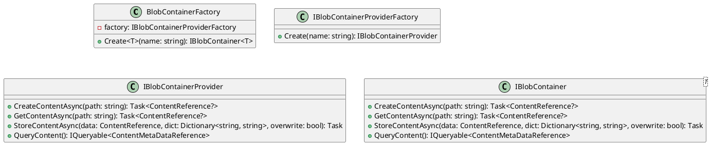
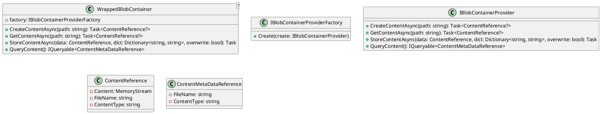

Here is the documentation for the source code files:

**BlobContainerFactoryTests.cs**

This unit test class tests the `BlobContainerFactory` class, which is responsible for creating instances of `IBlobContainer<T>`.

**Public Methods**

* `CreateTest_Named_Keyed`: Tests creating a `IBlobContainer<T>` instance using a named provider.
* `CreateTest_Named_Factory`: Tests creating a `IBlobContainer<T>` instance using a factory provider.
* `CreateTest_NoTag`: Tests creating a `IBlobContainer<T>` instance without a tag.
* `CreateTest_TableTag`: Tests creating a `IBlobContainer<T>` instance with a table tag.
* `CreateTest_ContainerTag`: Tests creating a `IBlobContainer<T>` instance with a container tag.

**Class Diagram**

Please refer to the PlantUML class diagram below:

**ServiceRegistryTests.cs**

This unit test class tests the `ServiceRegistry` class, which is responsible for registering services.

**Public Methods**

* `Create_IBlobContainer__ContainerTargetClass_Test`: Tests registering an `IBlobContainer` instance for the `ContainerTargetClass` type.
* `Create_IBlobContainer__Keyed_Test`: Tests registering an `IBlobContainer` instance using a key.

**WrappedBlobContainerTests.cs**

This unit test class tests the `WrappedBlobContainer` class, which is a wrapper around an `IBlobContainer<T>` instance.

**Public Methods**

* `DeleteContentAsyncTest`: Tests deleting content using the `DeleteContentAsync` method.
* `GetContentAsyncTest`: Tests getting content using the `GetContentAsync` method.
* `GetContentMetaDataAsyncTest`: Tests getting content metadata using the `GetContentMetaDataAsync` method.
* `StoreContentAsyncTest`: Tests storing content using the `StoreContentAsync` method.
* `StoreContentMetaDataAsyncTest`: Tests storing content metadata using the `StoreContentMetaDataAsync` method.
* `QueryContentTest`: Tests querying content using the `QueryContent` method.

**Class Diagram**

Please refer to the PlantUML class diagram below:

Note: The class diagrams are generated using PlantUML and may not be 100% accurate.