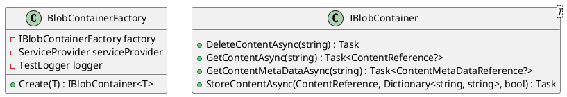
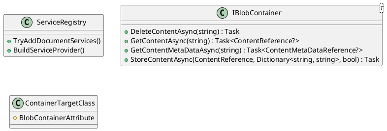

Here is the documentation for the source code in Markdown format, with PlantUML diagrams and sequence diagrams:

**BlobContainerFactoryTests**
================================

This test class tests the `BlobContainerFactory` class, which is responsible for creating instances of `IBlobContainer<T>`.

### Class Diagram

### Test Methods
The following test methods test the `BlobContainerFactory` class:
* `CreateTest_Named_Keyed`: Tests the creation of a BlobContainer instance with a named keyed provider.
* `CreateTest_Named_Factory`: Tests the creation of a BlobContainer instance with a named provider and a factory.
* `CreateTest_NoTag`: Tests the creation of a BlobContainer instance with a no-tag provider.
* `CreateTest_TableTag`: Tests the creation of a BlobContainer instance with a table-tag provider.
* `CreateTest_ContainerTag`: Tests the creation of a BlobContainer instance with a container-tag provider.

### Sequence Diagram
```plantuml
@startuml
 participant "BlobContainerFactory" as factory
 participant "ServiceProvider" as serviceProvider
 participant "IBlobContainerProvider" as provider

 sequenceDiagram
    note left:Facts
        factory creates provider with serviceProvider
    note right:BlobContainerFactory

    factory->>serviceProvider: Get service
    serviceProvider->>provider: Provider instance
    factory->>provider: Create BlobContainer
    provider->>factory: BlobContainer instance
    note right:CreateBlobContainer

    factory->>provider: Create BlobContainer with parameters
    provider->>factory: BlobContainer instance
    note right:CreateBlobContainer parameters
end
@enduml
```

**ServiceRegistryTests**
=====================

This test class tests the `ServiceRegistry` class, which is responsible for registering services in the ASP.NET Core DI container.

### Test Methods
The following test methods test the `ServiceRegistry` class:
* `Create_IBlobContainer__ContainerTargetClass_Test`: Tests the creation of an `IBlobContainer<ContainerTargetClass>` instance.
* `Create_IBlobContainer__Keyed_Test`: Tests the creation of an `IBlobContainer` instance with a keyed provider.

### Class Diagram


**WrappedBlobContainerTests**
==========================

This test class tests the `WrappedBlobContainer` class, which is a wrapper around an `IBlobContainer<T>` instance.

### Test Methods
The following test methods test the `WrappedBlobContainer` class:
* `DeleteContentAsyncTest`: Tests the deletion of content using the `DeleteContentAsync` method.
* `GetContentAsyncTest`: Tests the retrieval of content using the `GetContentAsync` method.
* `GetContentMetaDataAsyncTest`: Tests the retrieval of content metadata using the `GetContentMetaDataAsync` method.
* `StoreContentMetaDataAsyncTest`: Tests the storage of content metadata using the `StoreContentMetaDataAsync` method.
* `StoreContentAsyncTest`: Tests the storage of content using the `StoreContentAsync` method.
* `QueryContentTest`: Tests the querying of content using the `QueryContent` method.

### Class Diagram
```plantuml
@startuml
class WrappedBlobContainer<T> {
  - IBlobContainerFactory factory
  - IBlobContainer<T> container

  + DeleteContentAsync(string) : Task
  + GetContentAsync(string) : Task<ContentReference?>
  + GetContentMetaDataAsync(string) : Task<ContentMetaDataReference?>
  + StoreContentAsync(ContentReference, Dictionary<string, string>, bool) : Task
  + QueryContent() : IQueryable<ContentMetaDataReference>
}

class IBlobContainerFactory {
  + Create(T) : IBlobContainer<T>
}

class IBlobContainer<T> {
  + DeleteContentAsync(string) : Task
  + GetContentAsync(string) : Task<ContentReference?>
  + GetContentMetaDataAsync(string) : Task<ContentMetaDataReference?>
  + StoreContentAsync(ContentReference, Dictionary<string, string