**README**

This repository contains test files for the blob container factory and wrapped blob container classes.

**Summary**

The blob container factory provides a way to create instances of blob containers based on the type of container requested. The factory uses a service provider to resolve the correct implementation of the `IBlobContainerProvider` interface.

The wrapped blob container class wraps an instance of the `IBlobContainerProvider` interface and provides additional functionality for storing and retrieving content.

**Technical Summary**

The code uses several design patterns and architectural patterns:

* Dependency Injection: The blob container factory uses a service provider to resolve dependencies.
* Interface-based programming: The code uses interfaces to define the contracts for the blob container provider and wrapped blob container.
* Abstract Factory: The blob container factory provides a way to create instances of blob containers based on the type of container requested.

**Component Diagram**

```plantuml
@startuml
class BlobContainerFactory {
    - serviceProvider: ServiceProvider
    - providers: List<IBlobContainerProvider>
}

class IBlobContainerProvider {
    + Create(ContainerType type): IBlobContainer
}

class WrappedBlobContainer {
    - blobContainer: IBlobContainer
    + Create(BlobContainerFactory factory): WrappedBlobContainer
}

class IBlobContainer {
    + DeleteContentAsync(string path): Task
    + GetContentAsync(string path): Task<ContentReference?>
    + GetContentMetaDataAsync(string path): Task<ContentMetaDataReference?>
    + StoreContentMetaDataAsync(ContentMetaDataReference data): Task<bool>
    + StoreContentAsync(ContentReference data, Dictionary<string, string> metadata): Task
    + QueryContent(): IQueryable<ContentMetaDataReference>
}

class ServiceProvider {
    + GetRequiredService(Type serviceType): object
}

class TestContext {
    + TestLogger: ILogger
}

TestContext -> ServiceProvider
ServiceProvider -> BlobContainerFactory
BlobContainerFactory -> IBlobContainerProvider
IBlobContainerProvider -> WrappedBlobContainer
WrappedBlobContainer -> IBlobContainer
@enduml
```

In this diagram, the blob container factory uses the service provider to resolve dependencies and create instances of the `IBlobContainerProvider` interface. The `IBlobContainerProvider` interface defines the contract for creating instances of `IBlobContainer`. The wrapped blob container class wraps an instance of `IBlobContainer` and provides additional functionality for storing and retrieving content. The service provider is used to resolve dependencies and create instances of the `BlobContainerFactory`, which in turn creates instances of the `WrappedBlobContainer` class.