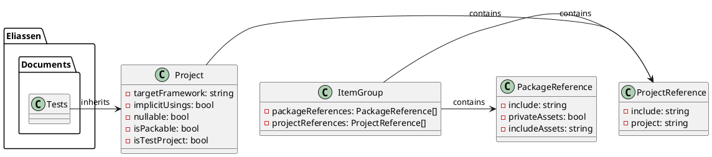

**Documentation for Eliassen.Documents.Tests.csproj**

### File Description

This is a .NET Core test project that contains tests for the Eliassen.Documents library. It is configured to use the MSTest framework and the Coverlet collector for code coverage reporting.

### Class Diagram (PlantUML)

### Description of Classes

* `Project`: Represents the test project. It has properties for the target framework, implicit usings, nullable settings, and test project status.
* `PackageReference`: Represents a package reference in the project. It has properties for the package include, private assets, and include assets.
* `ItemGroup`: Represents a group of items in the project. It contains a collection of package references and project references.
* `ProjectReference`: Represents a project reference in the item group. It has a property for the referenced project.

### Description of Relationships

* The `Project` class inherits from the `Microsoft.NET.Sdk` framework.
* The `ItemGroup` class contains a collection of `PackageReference` and `ProjectReference` objects.
* The `ProjectReference` class is contained within the `ItemGroup` class.

### Code Coverage

The project uses the Coverlet collector to report code coverage. The `PackageReference` for Coverlet includes the required assets and private assets for the collector to function correctly.