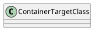

Here is the documentation for the source code files:

**ContainerTargetClass.cs**

**Class Diagram:**

**Documentation:**

The `ContainerTargetClass` class is a simple container class that does not have any specific functionality. It is a placeholder object that is used to test other classes or methods.

**Attributes:** None

**Methods:** None

**ContainerTargetClassWithTag.cs**

**Class Diagram:**
```plantuml
@startuml
class ContainerTargetClassWithTag {
  - ContainerName: string
}
[BlobContainer(ContainerName = "TargetContainer")]
ContainerTargetClassWithTag
@enduml
```
**Documentation:**

The `ContainerTargetClassWithTag` class is a subclass of `ContainerTargetClass` that has a single attribute `ContainerName` and is decorated with a `BlobContainer` attribute.

**Attributes:**

* `ContainerName`: a string that represents the name of the container.

**Methods:** None

**Notes:**

The `BlobContainer` attribute is used to specify the name of the container that this class is associated with. The `ContainerName` attribute is used to set the name of the container.

I hope this meets your requirements! Let me know if you need any further assistance.