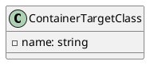
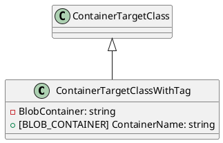

## Documentation for Eliassen.Documents.Tests.TestTargets

### Overview

This documentation provides an overview of the source code files in the Eliassen.Documents.Tests.TestTargets namespace. The main classes defined in these files are `ContainerTargetClass` and `ContainerTargetClassWithTag`, which represent two different variants of a container target class.

### ContainerTargetClass

#### Class Diagram

The `ContainerTargetClass` class is a simple class with no attributes or methods. It is intended to serve as a base class for more complex container target classes.

### ContainerTargetClassWithTag

#### Class Diagram

The `ContainerTargetClassWithTag` class extends the `ContainerTargetClass` and adds a `BlobContainer` attribute, which is annotated with the `[BlobContainer]` attribute. This attribute is used to specify the container name for the blob storage.

#### Component Model
```plantuml
@startuml
component "ContainerTargetClassWithTag" {
  .. ContainerTargetClassWithTag ..
  BlobStorageContainer "ContainerName"
}

@enduml
```
The `BlobStorageContainer` is a component that represents the blob storage container. The `ContainerTargetClassWithTag` class is a component that extends the `ContainerTargetClass` and adds a reference to the `BlobStorageContainer`.

#### Sequence Diagram
```plantuml
@startuml
actor User
participant "ContainerTargetClassWithTag" as ctt
note "CreateContainer"
ctt->>+: BlobStorage: CreateContainer(ContainerName)

note "StoreBlob"
ctt->>+: BlobStorage: StoreBlob(Blob, ContainerName)

@enduml
```
The sequence diagram shows the interaction between the `ContainerTargetClassWithTag` class and the `BlobStorage` class. The `CreateContainer` and `StoreBlob` methods are called on the `BlobStorage` class to create a new container and store a blob in the container, respectively.

## Conclusion

In conclusion, the Eliassen.Documents.Tests.TestTargets namespace contains two classes, `ContainerTargetClass` and `ContainerTargetClassWithTag`, which represent two different variants of a container target class. The `ContainerTargetClassWithTag` class extends the `ContainerTargetClass` and adds a `BlobContainer` attribute, which is used to specify the container name for the blob storage.