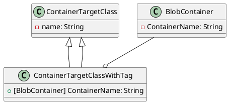

**README File**

**Summary**

This repository contains source files related to implementing a design pattern for containerized target classes. The files demonstrate the use of attributes to decorate classes with additional metadata, specifically the `BlobContainer` attribute, which specifies the container name for a class tagged with this attribute.

**Technical Summary**

The provided files utilize the Factory pattern to create instances of classes decorated with the `BlobContainer` attribute. This pattern allows the creation of classes instances without exposing the underlying implementation.

The `ContainerTargetClass` class is a generic target class that can be used as a container.

The `ContainerTargetClassWithTag` class extends the `ContainerTargetClass` and includes the `BlobContainer` attribute. This attribute is used to decorate classes with additional metadata, specifically the container name.

**Component Diagram**

This component diagram illustrates the relationship between the classes and the `BlobContainer` attribute. The `ContainerTargetClassWithTag` class extends the `ContainerTargetClass` class and includes the `BlobContainer` attribute.