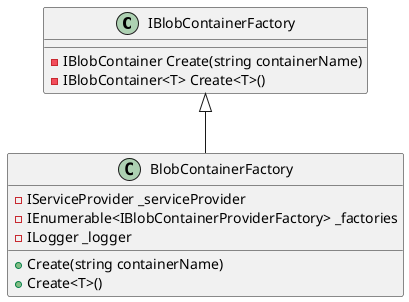

Here is the documentation and class diagrams for the provided source code files using PlantUML:

**BlobContainerFactory Class Diagram:**



**WrappedBlobContainer Class Diagram:**

```plantuml
@startuml
class IBlobContainer<T> {
  - Task DeleteContentAsync(string path)
  - Task<ContentReference?> GetContentAsync(string path)
  - Task<ContentMetaDataReference?> GetContentMetaDataAsync(string path)
  - IQueryable<ContentMetaDataReference> QueryContent()
  - Task StoreContentAsync(ContentReference reference, dictionary<string, string>? metadata = null, bool overwrite = false)
  - Task<bool> StoreContentMetaDataAsync(ContentMetaDataReference reference)
}

class WrappedBlobContainer<T> {
  - internal IQueryable _wrapped
  + WrappedBlobContainer(IBlobContainerFactory factory)
  + WrappedBlobContainer(IBlobContainer wrapper)
}

IBlobContainer<T> <|-- WrappedBlobContainer<T>

@enduml
```

**Documentation:**

**BlobContainerFactory Class:**

The `BlobContainerFactory` class is responsible for creating instances of `IBlobContainer` interfaces. It takes an `IServiceProvider`, an `IEnumerable<IBlobContainerProviderFactory>` and an `ILogger` in its constructor.

The `Create` method creates an instance of `IBlobContainer` using the provided container name. It first checks if the container already exists in the service provider, then checks if any of the factory objects can create a container with the provided name. If none of these options work, it uses the default container provider.

The `Create<T>` method creates an instance of `IBlobContainer<T>` by calling the `Create` method with the type name.

**WrappedBlobContainer Class:**

The `WrappedBlobContainer<T>` class is a wrapper around an instance of `IBlobContainer<T>`. It takes an `IBlobContainerFactory` in its constructor, which is used to create the underlying container.

All the methods in `WrappedBlobContainer<T>` delegate to the underlying container. The constructor takes an `IBlobContainerFactory` which is used to create the underlying container.

Each of the methods in `WrappedBlobContainer<T>` delegates to the underlying `IBlobContainer<T>`. If an underlying implementation is not available, it will throw a `NullReferenceException`.

**Note:** The `ActivatorUtilitiesConstructor` attribute on the `WrappedBlobContainer` constructor is used to indicate that this constructor is special and should be used when creating instances of this class.

I hope this helps! Let me know if you have any further questions.