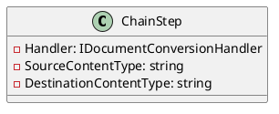
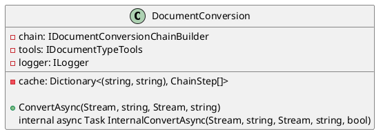
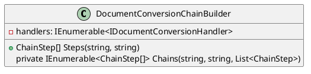
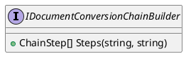

# Eliassen.Documents.Conversion Documentation

## Overview

The Eliassen.Documents.Conversion namespace provides classes and interfaces for building and executing document conversion chains. These chains allow for the conversion of documents from one format to another, using a series of document conversion handlers.

## Classes

### ChainStep

* Represents a step in a document conversion chain.



### DocumentConversion

* Represents a document conversion service.



### DocumentConversionChainBuilder

* Represents a builder for constructing document conversion chains.



### IDocumentConversionChainBuilder

* Represents a document conversion chain builder interface.



## Methods

### DocumentConversion.ConvertAsync

* Converts the content of a source stream to a destination stream asynchronously.

### DocumentConversionChainBuilder.Steps

* Constructs the document conversion steps for converting from a source content type to a destination content type.

### DocumentConversionChainBuilder.Chains

* Recursively generates possible document conversion chains for converting from a source content type to a destination content type.

## Interfaces

### IDocumentConversionHandler

* Not shown in the documentation.

## PlantUML Diagrams

```plantuml
@startuml
class IDocumentConversionHandler {
  + SupportedSource(string)
  + SupportedDestination(string)
  + ConvertAsync(Stream, string, Stream, string)
}

class IDocumentConversionChainBuilder {
  + ChainStep[] Steps(string, string)
}

class DocumentConversion {
  - chain: IDocumentConversionChainBuilder
  - tools: IDocumentTypeTools
  + ConvertAsync(Stream, string, Stream, string)
  internal async Task InternalConvertAsync(Stream, string, Stream, string, bool)
}

class DocumentConversionChainBuilder {
  - handlers: IEnumerable<IDocumentConversionHandler>
  + ChainStep[] Steps(string, string)
  private IEnumerable<ChainStep[]> Chains(string, string, List<ChainStep>)
}

class ChainStep {
  - Handler: IDocumentConversionHandler
  - SourceContentType: string
  - DestinationContentType: string
}

DocumentConversion --*> IDocumentConversionChainBuilder
IDocumentConversionChainBuilder --*> DocumentConversionChainBuilder
DocumentConversionChainBuilder --* IDocumentConversionHandler
ChainStep --* IDocumentConversionHandler

@enduml
```

This documentation provides an overview of the classes, methods, and interfaces in the Eliassen.Documents.Conversion namespace, as well as the relationships between them. The PlantUML diagrams provide a visual representation of the classes and their relationships, making it easier to understand the architecture of the system.