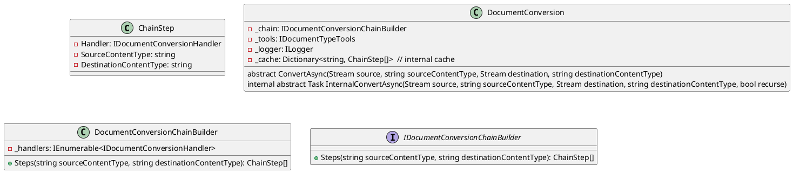

Here is the documentation for the provided source code files:

**ChainStep.cs**

This is a record class that represents a step in a document conversion chain.

* `Handler`: a required property that gets or sets the document conversion handler for this step.
* `SourceContentType`: a required property that gets or sets the content type of the source document for this step.
* `DestinationContentType`: a required property that gets or sets the content type of the destination document for this step.

**DocumentConversion.cs**

This is a class that represents a document conversion service. It implements the `IDocumentConversion` interface.

* `ConvertAsync`: a method that converts the content of a source stream to a destination stream asynchronously.
* `InternalConvertAsync`: an internal method that performs the actual conversion. It uses a cache to store conversion chains.

**DocumentConversionChainBuilder.cs**

This is a class that represents a builder for constructing document conversion chains.

* `Steps`: a method that constructs the document conversion steps for converting from a specified source content type to a destination content type.

**IDocumentConversionChainBuilder.cs**

This is an interface that represents a document conversion chain builder.

* `Steps`: a method that gets the conversion steps from a source content type to a destination content type.

**Class Diagram**

Here is a class diagram in PlantUML:

Note that this diagram is not exhaustive, but it shows the main classes and interfaces involved in the document conversion process.