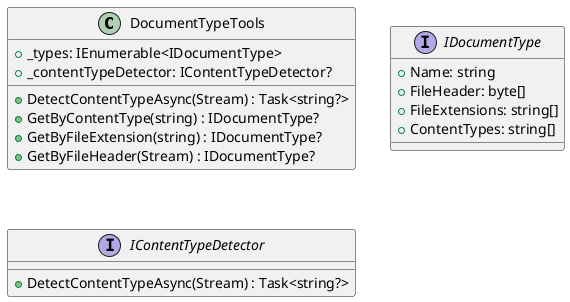

**DocumentTypeTools.cs**

Class Diagram:

**Summary:**
The `DocumentTypeTools` class provides a set of tools for managing document types. It allows for detecting the content type of a stream, retrieving document types by content type, file extension, or file header, and scanning a stream to detect the content type.

**Methods:**

* `DetectContentTypeAsync(Stream)`: Scans the stream to detect the content type.
* `GetByContentType(string)`: Retrieves the document type associated with the specified content type.
* `GetByFileExtension(string)`: Retrieves the document type associated with the specified file extension.
* `GetByFileHeader(Stream)`: Retrieves the document type associated with the specified file header.

**Properties:**

* `_types`: A collection of document types.
* `_contentTypeDetector`: An optional content type detector.

**Eliassen.Documents.csproj**

Project File:
```xml
<Project Sdk="Microsoft.NET.Sdk">
  <PropertyGroup>
    <TargetFramework>net8.0</TargetFramework>
    <ImplicitUsings>false</ImplicitUsings>
    <Nullable>enable</Nullable>
    <GenerateDocumentationFile>True</GenerateDocumentationFile>
    <GenerateAssemblyInfo>true</GenerateAssemblyInfo>
    <PackageReadmeFile>Readme.Documents.md</PackageReadmeFile>
  </PropertyGroup>
  <ItemGroup>
    <InternalsVisibleTo Include="Eliassen.Documents.Tests" />
  </ItemGroup>
  <ItemGroup>
    <ProjectReference Include="..\Eliassen.Documents.Abstractions\Eliassen.Documents.Abstractions.csproj" />
    <ProjectReference Include="..\Eliassen.TestUtilities\Eliassen.TestUtilities.csproj" />
  </ItemGroup>
</Project>
```
**Summary:**
This is a project file for the Eliassen.Documents library. It specifies the target framework, explicit namespace imports, and generates documentation and assembly information.

**Readme.Documents.md**

Documentation:
```markdown
# Eliassen/Documents

## Overview

The Eliassen.Documents library provides functionality for managing documents, including storage, conversion, and type detection. It offers classes and factories for creating and interacting with blob containers, document conversion services, and document type tools. These components enable developers to store, convert, and identify document types in their applications.

## Key Classes and Features

* **BlobContainerFactory**: Creates blob containers for storing documents.
* **DocumentConversion**: Performs document conversion from one format to another.
* **DocumentConversionChainBuilder**: Constructs document conversion chains.
* **DocumentTypeTools**: Provides tools for managing document types, including content type detection.
* **ServiceCollectionExtensions**: Extension methods for configuring document-related services in dependency injection.

## Usage Example

Here's a simple example demonstrating how to use Eliassen.Documents to perform document conversion:

```csharp
using Eliassen.Documents.Conversion;
using Eliassen.Documents.DocumentTypeTools;

// Initialize document conversion chain builder
var conversionChainBuilder = new DocumentConversionChainBuilder();

// Add document conversion steps for converting from PDF to Word
var steps = conversionChainBuilder.Steps("application/pdf", "application/msword");

// Initialize document conversion service
var documentConversion = new DocumentConversion(conversionChainBuilder);

// Perform document conversion asynchronously
await documentConversion.ConvertAsync(sourceStream, "application/pdf", destinationStream, "application/msword");
```

**Summary:**
This is a brief overview of the Eliassen.Documents library, highlighting its key classes and features, as well as a simple usage example.

**ServiceCollectionExtensions.cs**

Class Diagram:
```plantuml
@startuml
class ServiceCollectionExtensions {
  + TryAddDocumentServices(IServiceCollection) : IServiceCollection
}

interface IServiceCollection {
  + TryAddSingleton<T>(T) : IServiceCollection
  + TryAddTransient<T>(T) : IServiceCollection
}

class DocumentConversion : DocumentConversion
{
  + ChainBuilder: DocumentConversionChainBuilder
}

class DocumentConversionChainBuilder : DocumentConversionChainBuilder
{
  + Steps(string, string) : Ienumerable<IDocumentConversionStep>
}

interface IContentTypeDetector {
  + DetectContentTypeAsync(Stream) : Task<string?>
}
@enduml
```
**Summary:**
The `ServiceCollectionExtensions` class provides extension methods for configuring document-related services in the ServiceCollection.

**Methods:**

* `TryAddDocumentServices(IServiceCollection)`: