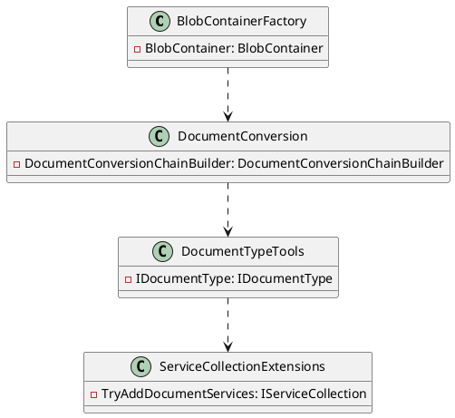

# Eliassen.Documents

## Overview

The Eliassen.Documents library provides functionality for managing documents, including storage, conversion, and type detection. It offers classes and factories for creating and interacting with blob containers, document conversion services, and document type tools. These components enable developers to store, convert, and identify document types in their applications.

### Component Model



## Source Files

### DocumentTypeTools.cs

The `DocumentTypeTools` class is responsible for managing document types. It provides methods for detecting the content type of a document, retrieving a document type based on a content type, file extension, or file header, and associating a document type with a blob container.

```csharp
public class DocumentTypeTools : IDocumentTypeTools
{
    private readonly IEnumerable<IDocumentType> _types;
    private readonly IContentTypeDetector? _contentTypeDetector;

    public DocumentTypeTools(IEnumerable<IDocumentType> types, IContentTypeDetector? contentTypeDetector = null)
    {
        _types = types;
        _contentTypeDetector = contentTypeDetector;
    }

    public virtual async Task<string?>
      DetectContentTypeAsync(Stream source) =>
        _contentTypeDetector is not null
          ? await _contentTypeDetector.DetectContentTypeAsync(source)
          : (GetByFileHeader(source)?.ContentTypes.FirstOrDefault());

    public virtual IDocumentType? GetByContentType(string contentType) =>
      _types.FirstOrDefault(t => t.ContentTypes.Any(i => string.Equals(i, contentType, StringComparison.OrdinalIgnoreCase)));

    public virtual IDocumentType? GetByFileExtension(string fileExtension) =>
      _types.FirstOrDefault(t => t.FileExtensions.Any(i => string.Equals(i, fileExtension, StringComparison.OrdinalIgnoreCase)));

    public virtual IDocumentType? GetByFileHeader(Stream stream)
    {
        var maxRead = _types.Max(t => t.FileHeader.Length);
        if (maxRead > 0)
        {
            var p = stream.Position;

            Span<byte> temp = new byte[maxRead];
            var possible = _types.Where(t => t.FileHeader.Length > 0);
            stream.Read(temp);

            foreach (var t in possible.Where(t => t.FileHeader.Length > 0))
                if (temp.StartsWith(t.FileHeader))
                    return t;

            stream.Position = 0;
        }

        return default;
    }
}
```

### Eliassen.Documents.csproj

The `Eliassen.Documents.csproj` file is the project file for the Eliassen.Documents library. It specifies the target framework as .NET 8.0, and includes references to other projects and packages.

```xml
<Project Sdk="Microsoft.NET.Sdk">
  <PropertyGroup>
    <TargetFramework>net8.0</TargetFramework>
    <ImplicitUsings>false</ImplicitUsings>
    <Nullable>enable</Nullable>
    <GenerateDocumentationFile>True</GenerateDocumentationFile>
    <PackageReadmeFile>Readme.Documents.md</PackageReadmeFile>
    <GenerateAssemblyInfo>true</GenerateAssemblyInfo>
  </PropertyGroup>
  <ItemGroup>
    <InternalsVisibleTo Include="Eliassen.Documents.Tests" />
  </ItemGroup>
  <ItemGroup>
    <ProjectReference Include="..\Eliassen.Documents.Abstractions\Eliassen.Documents.Abstractions.csproj" />
    <ProjectReference Include="..\Eliassen.TestUtilities\Eliassen.TestUtilities.csproj" />
  </ItemGroup>
</Project>
```

### Readme.Documents.md

The `Readme.Documents.md` file provides an overview of the Eliassen.Documents library, including its key classes and features.

```markdown
# Eliassen.Documents

## Overview

The Eliassen.Documents library provides functionality for managing documents, including storage, conversion, and type detection. It offers classes and factories for creating and interacting with blob containers, document conversion services, and document type tools. These components enable developers to store, convert, and identify document types in their applications.

## Key Classes and Features

- **BlobContainerFactory**: Creates blob containers for storing documents.
- **DocumentConversion**: Performs document conversion from one format to another.
- **DocumentConversionChainBuilder**: Constructs document conversion chains.
- **DocumentTypeTools**: Provides tools for managing document types, including content type detection.
- **ServiceCollectionExtensions**: Extension methods for configuring document-related services in dependency injection.

## Usage Example

Here's a simple example demonstrating how to use Eliassen.Documents to perform document conversion:

```csharp
using Eliassen.Documents.Conversion;
using Eliassen.Documents.DocumentTypeTools;

// Initialize document conversion chain builder
var conversionChainBuilder = new